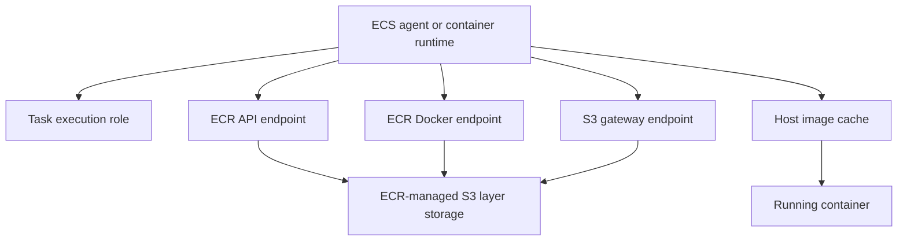
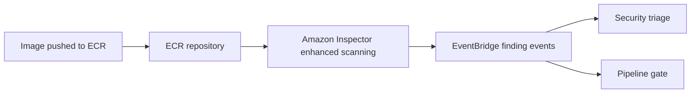
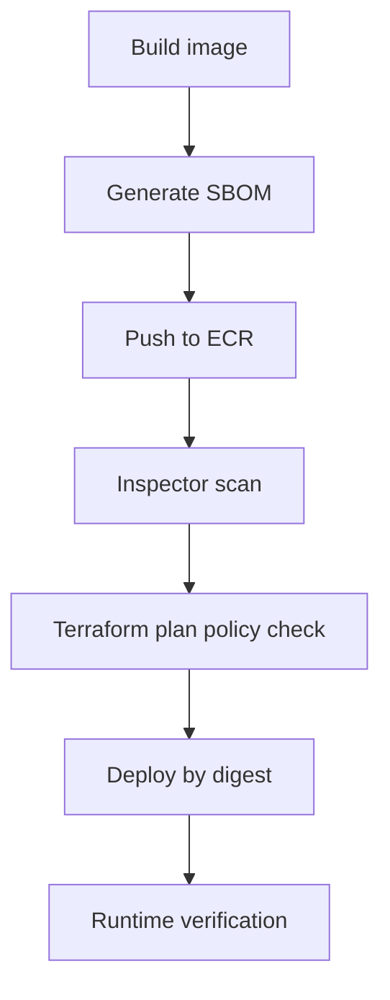

Amazon Elastic Container Registry is the control point for container images in AWS. If ECR is loose, every downstream service that pulls images from it inherits that risk: ECS, EKS, Lambda, App Runner, CI/CD runners, and developer workstations.

The baseline is straightforward: private repositories, immutable production tags, continuous scanning, lifecycle cleanup, constrained pull paths, and deployment by digest.

## Recommended Pattern

Treat ECR as part of the software supply chain, not just storage.

- Use private repositories by default.
- Enable tag immutability for production repositories.
- Prefer enhanced scanning with Amazon Inspector for continuously scanned images.
- Use lifecycle policies so stale and untagged images do not accumulate forever.
- Pull images from private subnets through ECR VPC endpoints and an S3 gateway endpoint.
- Separate the ECS task execution role from the application task role.
- Deploy production workloads by image digest, not floating tags.

## ECR Pull Path From ECS

For private subnet workloads, an ECR pull is not only a call to ECR. The runtime authenticates to ECR, gets the manifest and layer URLs, then downloads image layers from S3-backed storage managed by ECR.



For Fargate and private subnet patterns, create:

- `com.amazonaws.<region>.ecr.api`
- `com.amazonaws.<region>.ecr.dkr`
- `com.amazonaws.<region>.s3` as a gateway endpoint

If the task writes logs with the `awslogs` driver and has no NAT path, also add the CloudWatch Logs endpoint. Endpoint security groups must allow HTTPS from the task subnets.

## IAM Baseline

For ECS on Fargate, the task execution role pulls the image. The application task role is for the application itself.

Minimum ECR pull permissions are:

```json
{
  "Version": "2012-10-17",
  "Statement": [
    {
      "Effect": "Allow",
      "Action": ["ecr:BatchGetImage", "ecr:GetDownloadUrlForLayer", "ecr:GetAuthorizationToken"],
      "Resource": "*"
    }
  ]
}
```

`ecr:GetAuthorizationToken` requires `Resource: "*"`. Scope repository-level actions where the API supports it.

For cross-account pulls, use an ECR repository policy on the image-producing account and IAM permissions on the consuming principal. Do not make repositories public to solve cross-account access.

## Scanning

ECR has two scanning modes:

- Basic scanning: OS vulnerability scanning using AWS native scanning and CVE data. It supports manual scans and scan-on-push.
- Enhanced scanning: Amazon Inspector integration with scan-on-push or continuous scanning, OS and language package vulnerability coverage, EventBridge events, and visibility into affected ECS and EKS usage.

For production, use enhanced scanning with continuous scan filters for production repositories. Use EventBridge findings to route critical or exploitable findings to the same place as the rest of your vulnerability workflow.



Do not assume scan-on-push is enough. A clean image today can become vulnerable tomorrow when a new CVE is published.

## Encryption

ECR stores image data in Amazon S3 buckets managed by ECR. By default, repositories use server-side encryption with S3-managed keys. For higher-control environments, create repositories with AWS KMS encryption and a customer managed key.

The important operational detail: repository encryption configuration is set at creation time and cannot be changed later. If a repository needs to move from default encryption to a customer managed key, create a new repository and migrate the images.

For customer managed KMS keys:

- The key must be in the same Region as the repository.
- The principal creating the repository needs the required ECR permissions plus KMS permissions such as `kms:CreateGrant`, `kms:RetireGrant`, and `kms:DescribeKey`.
- Do not revoke the grants ECR creates on the key; delete the repository instead if you need to remove access cleanly.
- Use `kms:ViaService` conditions to restrict key use to ECR in the intended Region.

## Tag Strategy

Mutable production tags are a supply chain footgun. If `prod-v1` can be overwritten, deployment history becomes ambiguous and rollback becomes less trustworthy.

Use one of these patterns:

- Immutable tags for production repositories.
- `IMMUTABLE_WITH_EXCLUSION` if your workflow needs specific mutable development tags.
- Deploy production by digest: `repo@sha256:<digest>`.

`latest` is fine as a developer convenience. It is not a production release identifier.

## CI/CD Guardrails

The cloud security deliverable should be a paved road: reusable modules and policy checks that make the secure path the easy path.



Enforce these checks in code review or CI:

- ECR repositories are private.
- Tag immutability is enabled for production.
- Enhanced scanning is enabled for production repositories.
- A lifecycle policy exists.
- Production deployment uses an image digest.
- ECS task definitions include an execution role.
- Application task role and execution role are separate.
- Containers do not run as root.
- `readonlyRootFilesystem` is enabled unless an exception exists.
- Privileged containers are denied.
- Plaintext secrets are not passed as environment variables.

## Runtime Verification

CI/CD does not catch every out-of-band change. Verify the deployed state.

- Alert on ECR repository policy changes that grant broad or cross-account access.
- Alert on public ECR usage unless explicitly approved.
- Track Inspector findings for images that are currently deployed.
- Detect ECS task definitions using `:latest`, root users, privileged mode, or writable root filesystems.
- Review lifecycle policy gaps so repositories do not become unbounded image archives.

## Common Failure Modes

- Private subnet tasks can reach ECR but cannot pull layers because the S3 gateway endpoint is missing.
- The image pull token was generated in the wrong Region.
- The Docker auth token expired; ECR authorization tokens are valid for 12 hours.
- The task execution role is missing ECR pull permissions.
- The application task role was given ECR permissions by mistake.
- A customer managed KMS key policy or grant was changed and ECR can no longer use the key.
- A production deployment used a mutable tag and pulled a different image than expected.

## Review Checklist

- [ ] Repository is private.
- [ ] Production tags are immutable or use controlled immutability exclusions.
- [ ] Production deploys reference image digests.
- [ ] Enhanced scanning is enabled for production repositories.
- [ ] Lifecycle policy is configured.
- [ ] KMS encryption is selected at repository creation where required.
- [ ] Private subnet pulls have `ecr.api`, `ecr.dkr`, and S3 gateway endpoints.
- [ ] ECS task execution role has ECR pull permissions.
- [ ] Task execution role and application task role are separate.
- [ ] Containers run as non-root with read-only root filesystems where possible.

## References

- [Amazon ECR image scanning](https://docs.aws.amazon.com/AmazonECR/latest/userguide/image-scanning.html)
- [Enhanced scanning with Amazon Inspector](https://docs.aws.amazon.com/AmazonECR/latest/userguide/image-scanning-enhanced.html)
- [Amazon ECR VPC endpoints](https://docs.aws.amazon.com/AmazonECR/latest/userguide/vpc-endpoints.html)
- [ECR encryption at rest](https://docs.aws.amazon.com/AmazonECR/latest/userguide/encryption-at-rest.html)
- [Using ECR images with ECS](https://docs.aws.amazon.com/AmazonECR/latest/userguide/ECR_on_ECS.html)
- [ECS task execution IAM role](https://docs.aws.amazon.com/AmazonECS/latest/developerguide/task_execution_IAM_role.html)
- [ECR private repository policies](https://docs.aws.amazon.com/AmazonECR/latest/userguide/repository-policies.html)
- [ECR private registry authentication](https://docs.aws.amazon.com/AmazonECR/latest/userguide/registry_auth.html)
