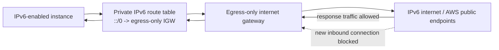

An egress-only internet gateway provides outbound-only native IPv6 internet access for VPC resources.

It fills an important gap: IPv6 addresses can be globally routable, but many workloads still need the IPv6 equivalent of "private subnet outbound only" behavior.

## Why It Exists

For IPv4, private instances can use a NAT gateway to initiate outbound connections and receive responses without allowing unsolicited inbound connections.

For native IPv6, there is no equivalent IPv4-style NAT requirement. IPv6 addresses can be globally routable. If a route table sends `::/0` to a normal internet gateway, then inbound-initiated IPv6 connectivity is possible when security controls allow it.

An egress-only internet gateway allows:

- Outbound IPv6 connections initiated by VPC resources.
- Response traffic for those connections.

It blocks:

- New inbound IPv6 connections initiated from outside the VPC.

## Architecture

## Route Table Pattern

| Destination   | Target                       | Purpose                          |
| ------------- | ---------------------------- | -------------------------------- |
| VPC IPv6 CIDR | local                        | Intra-VPC IPv6 routing           |
| `::/0`        | Egress-only internet gateway | Outbound-only IPv6 internet path |

Do not point `::/0` to a normal internet gateway when the intent is outbound-only IPv6.

## Comparison

| Use Case                      | IPv4 Pattern                   | Native IPv6 Pattern          |
| ----------------------------- | ------------------------------ | ---------------------------- |
| Bidirectional internet access | Internet gateway + public IPv4 | Internet gateway + IPv6      |
| Outbound-only internet access | NAT gateway                    | Egress-only internet gateway |
| IPv6-to-IPv4 translation      | DNS64/NAT64 with NAT gateway   | DNS64/NAT64 with NAT gateway |

## Security Considerations

- Egress-only internet gateways are stateful.
- You cannot associate security groups with them.
- Use security groups and NACLs on the resources/subnets.
- Include IPv6 in exposure management and detection logic.
- Review route tables for both `0.0.0.0/0` and `::/0`.

## AWS References

- [Egress-only internet gateways](https://docs.aws.amazon.com/vpc/latest/userguide/egress-only-internet-gateway.html)
- [Add egress-only internet access to a subnet](https://docs.aws.amazon.com/vpc/latest/userguide/egress-only-internet-gateway-working-with.html)
- [IP addressing for your VPCs and subnets](https://docs.aws.amazon.com/vpc/latest/userguide/vpc-ip-addressing.html)
