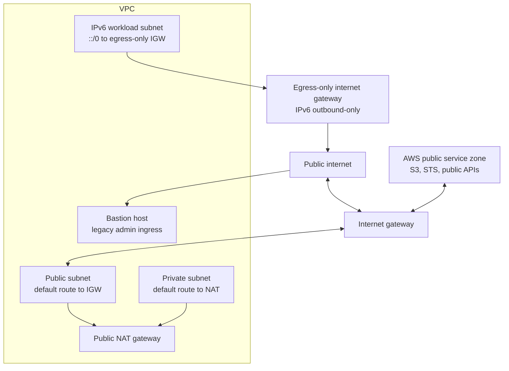

Public networking in a VPC is about controlled reachability between private AWS networks, AWS public service endpoints, and the public internet.

The key distinction is that public reachability is not a single switch. It is the result of several conditions lining up: gateway attachment, route tables, IP addressing, security groups, NACLs, DNS, and workload placement.

## Reading Order

1. [[aws-networking/public-networking/internet-gateways-ipv4-and-ipv6|Internet Gateways: IPv4 and IPv6]]
2. [[aws-networking/public-networking/public-subnets-and-route-tables|Public Subnets and Route Tables]]
3. [[aws-networking/public-networking/nat-gateways|NAT Gateways]]
4. [[aws-networking/public-networking/nat-instances|NAT Instances]]
5. [[aws-networking/public-networking/egress-only-internet-gateways-ipv6|Egress-Only Internet Gateways for IPv6]]
6. [[aws-networking/public-networking/bastion-hosts-and-jumpboxes|Bastion Hosts and Jumpboxes]]
7. [[aws-networking/public-networking/bring-your-own-ip|Bring Your Own IP]]
8. [[aws-networking/public-networking/public-networking-reference-architecture|Public Networking Reference Architecture]]

## Core Pattern

## Mental Model

- An internet gateway attaches to one VPC and enables routed access to the AWS public zone and public internet.
- A public subnet is a subnet whose route table sends internet-bound traffic to an internet gateway.
- IPv4 instances still use private IPv4 addresses inside the VPC. Public IPv4 behavior relies on public IPv4 association plus internet gateway translation.
- IPv6 addresses can be globally routable, so security controls and route tables become especially important.
- NAT gateways provide managed outbound IPv4 access for private subnets.
- Egress-only internet gateways provide outbound-only native IPv6 access.
- Bastion hosts are an older admin ingress pattern; Session Manager or EC2 Instance Connect Endpoint is often a better modern default.

## AWS References

- [Internet gateways](https://docs.aws.amazon.com/vpc/latest/userguide/VPC_Internet_Gateway.html)
- [NAT gateways](https://docs.aws.amazon.com/vpc/latest/userguide/vpc-nat-gateway.html)
- [Egress-only internet gateways](https://docs.aws.amazon.com/vpc/latest/userguide/egress-only-internet-gateway.html)
