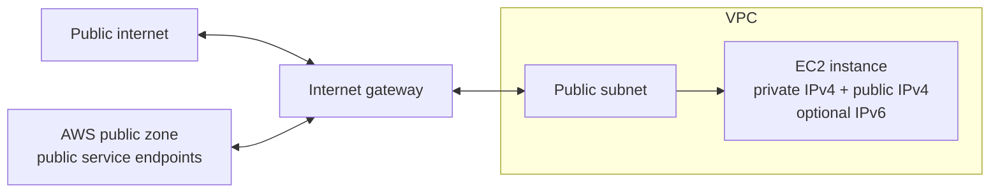
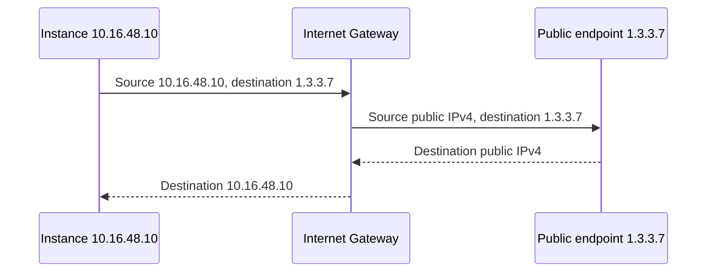
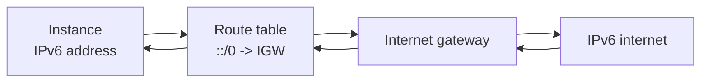

An internet gateway is a managed VPC gateway object that lets resources in public subnets communicate with the AWS public zone and the public internet.

Internet gateways are optional. Many VPCs, especially sensitive, isolated, or hybrid-only VPCs, should not have one attached.

## Core Properties

- An internet gateway attaches to one VPC.
- A VPC can have zero or one internet gateway attached.
- Internet gateways are regional, highly available, and horizontally scaled by AWS.
- They work across the Availability Zones used by the VPC.
- They support IPv4 and IPv6, but the mechanics differ.

The internet gateway is positioned between the VPC and the AWS public zone. That is why it can be used for both public internet access and access to AWS public service endpoints.

## IPv4 Behavior

Instances do not see a real public IPv4 address on their operating system interface. They receive a private IPv4 address from the subnet. If the instance has a public IPv4 address or Elastic IP address associated, the internet gateway performs one-to-one NAT on behalf of the instance.

For IPv4 internet access, the resource needs:

- A route to the internet gateway.
- A public IPv4 address or Elastic IP address.
- Security groups and NACLs that allow the traffic.

## IPv6 Behavior

IPv6 works differently. IPv6 addresses in AWS can be globally routable. For internet gateway traffic, there is no IPv4-style one-to-one NAT translation. The internet gateway routes IPv6 packets in and out of the VPC.

Because IPv6 can be publicly routable, route tables and security controls matter. If an IPv6 subnet has `::/0` routed to an internet gateway and security controls allow inbound traffic, external systems can initiate connections.

For outbound-only native IPv6, use an egress-only internet gateway instead.

## Public Subnet Definition

AWS commonly defines a public subnet as a subnet whose route table has a route to an internet gateway. For internet access to actually work, the instance also needs appropriate addressing and security rules.

## Common Misconfigurations

- Route table has `0.0.0.0/0` to the IGW, but instance has no public IPv4 address.
- Instance has a public IPv4 address, but subnet route table has no IGW default route.
- IPv6 `::/0` is added unintentionally, exposing dual-stack workloads.
- Security group allows `0.0.0.0/0` but IPv6 `::/0` was forgotten or accidentally allowed.
- A custom VPC is expected to behave like a default VPC, but no IGW or public route table exists.

## AWS References

- [Enable internet access for a VPC using an internet gateway](https://docs.aws.amazon.com/vpc/latest/userguide/VPC_Internet_Gateway.html)
- [Add internet access to a subnet](https://docs.aws.amazon.com/vpc/latest/userguide/working-with-igw.html)
- [Amazon EC2 instance IP addressing](https://docs.aws.amazon.com/AWSEC2/latest/UserGuide/using-instance-addressing.html)
