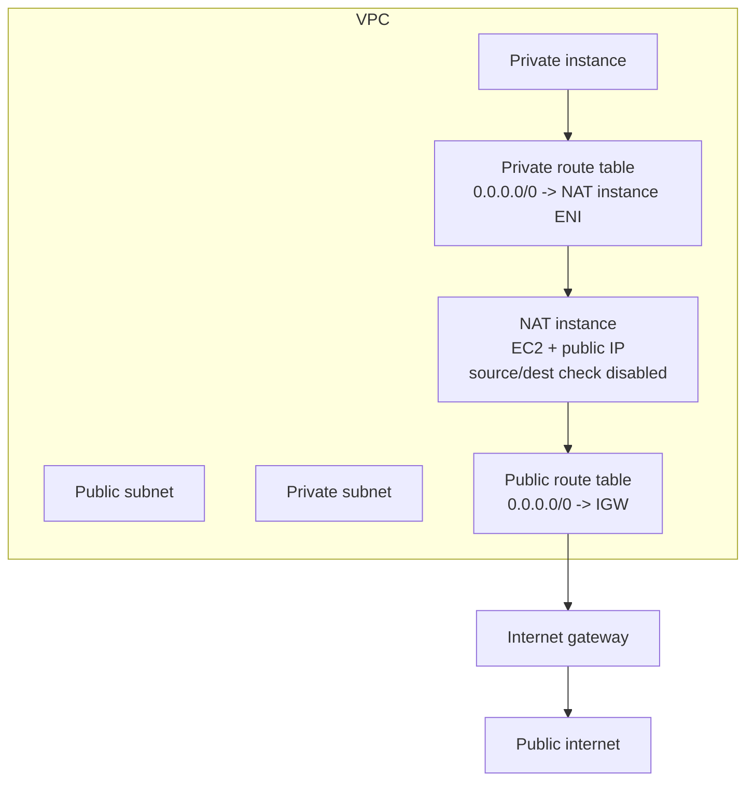
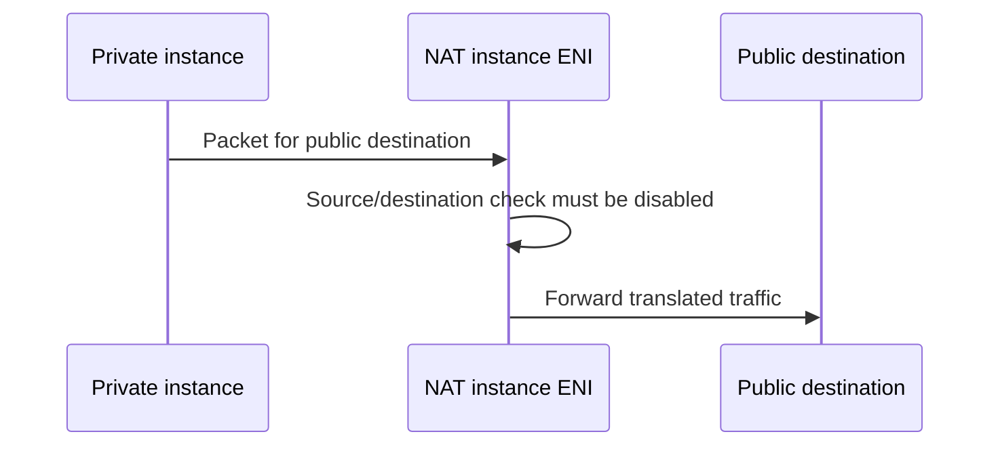

A NAT instance is an EC2 instance configured to perform network address translation. Before NAT gateways existed, this was the common pattern for private subnet internet egress.

Today, NAT gateways are the preferred default. NAT instances are useful only for specific requirements such as custom inspection, port forwarding, very small lab environments, or unusual routing behavior.

## Architecture

The NAT instance runs in a public subnet and needs a path to the internet gateway. Private subnet route tables point default IPv4 traffic at the NAT instance network interface.

## Source/Destination Checks

EC2 instances normally drop traffic when they are neither the source nor the destination. A NAT instance forwards traffic for other instances, so it must receive packets that are not addressed to itself.

Disable source/destination checks on the NAT instance ENI.

## NAT Instance vs NAT Gateway

| Feature             | NAT Gateway                  | NAT Instance            |
| ------------------- | ---------------------------- | ----------------------- |
| Management          | AWS managed                  | Self-managed EC2        |
| Scaling             | Managed by AWS               | Instance-size dependent |
| Availability        | Managed, AZ-scoped           | You design failover     |
| Security groups     | Not attached to NAT gateway  | Attached to ENI         |
| Custom software     | No                           | Yes                     |
| Port forwarding     | No direct host customization | Possible                |
| Recommended default | Yes                          | No                      |

## Why Use One At All?

Possible reasons:

- You need custom packet handling or inspection.
- You need explicit software-level control.
- You are building a lab or low-cost development environment.
- You intentionally want throughput bounded by instance size.
- You need a combined test bastion/NAT pattern and accept the risk.

## Security Considerations

- Patch and harden the instance like any exposed infrastructure component.
- Scope inbound management tightly.
- Monitor CPU, network throughput, and conntrack/NAT table pressure.
- Build high availability if production traffic depends on it.
- Avoid combining bastion and NAT roles in production.
- Prefer NAT gateway unless there is a documented exception.

## AWS References

- [Elastic network interfaces and source/destination checks](https://docs.aws.amazon.com/AWSEC2/latest/UserGuide/using-eni.html)
- [Infrastructure security in Amazon EC2](https://docs.aws.amazon.com/AWSEC2/latest/UserGuide/infrastructure-security.html)
- [NAT gateways](https://docs.aws.amazon.com/vpc/latest/userguide/vpc-nat-gateway.html)
