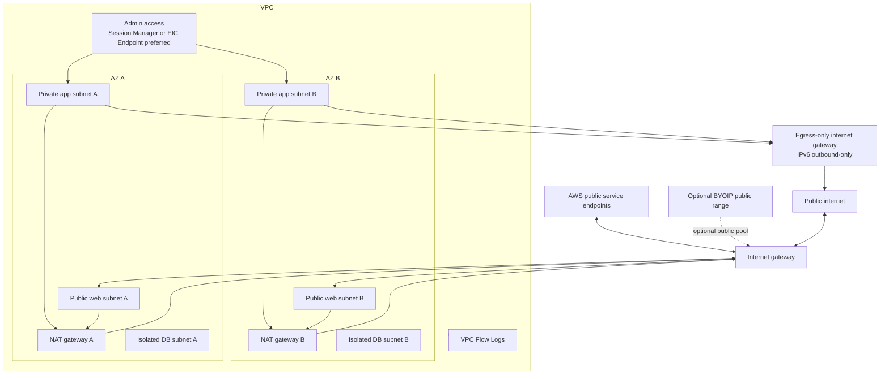
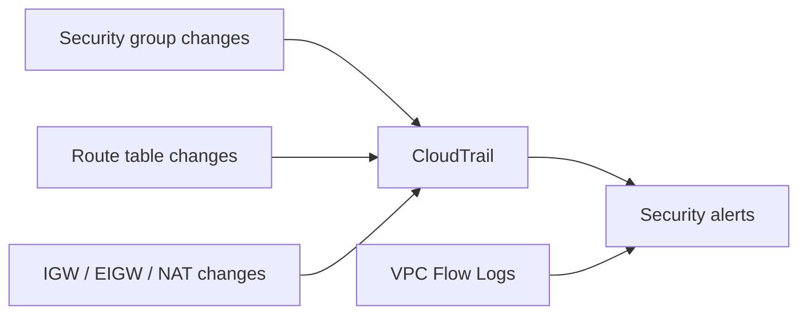

This reference architecture ties the public networking pieces together: internet gateway, public subnets, NAT gateways, IPv6 egress-only internet gateways, administrative access, BYOIP, and telemetry.

## Architecture

## Route Table Baseline

| Subnet Class   | IPv4 Default Route         | IPv6 Default Route              | Notes                       |
| -------------- | -------------------------- | ------------------------------- | --------------------------- |
| Public         | `0.0.0.0/0 -> IGW`         | `::/0 -> IGW` when intended     | Public ingress/egress       |
| Private app    | `0.0.0.0/0 -> NAT gateway` | `::/0 -> egress-only IGW`       | Outbound-only pattern       |
| Isolated DB    | None                       | None or explicit private routes | No public internet path     |
| Admin endpoint | Depends on pattern         | Depends on pattern              | Prefer private admin access |

## Recommended Defaults

- Public subnets contain load balancers, NAT gateways, and other intentional edge resources only.
- Application workloads run in private subnets.
- Databases and sensitive services run in isolated subnets.
- NAT gateways are deployed per AZ for production workloads.
- Native IPv6 outbound-only traffic uses egress-only internet gateways.
- Administration uses Session Manager or EC2 Instance Connect Endpoint before bastion hosts.
- Public IPv4 usage is minimized and tracked because it has cost and exposure implications.
- BYOIP is handled as a network governance process, not an application shortcut.

## Detection and Logging Points

Useful detections:

- New `0.0.0.0/0` or `::/0` route to an internet gateway.
- Public IPv4 assigned to an instance unexpectedly.
- Security group opened to `0.0.0.0/0` or `::/0` on admin ports.
- NAT gateway deleted or route removed.
- Egress-only internet gateway route changed to normal IGW for IPv6.
- Bastion host created without approved controls.
- Flow Logs disabled on public subnet or VPC.

## Review Checklist

- [ ] Public subnet route tables are intentionally associated.
- [ ] Public IPv4 auto-assignment is disabled unless required.
- [ ] IPv6 `::/0` routes are reviewed separately from IPv4.
- [ ] Private subnet egress goes through NAT, endpoints, firewalling, or documented private paths.
- [ ] NAT gateways are deployed per AZ where resiliency matters.
- [ ] Egress-only internet gateway is used for native IPv6 outbound-only access.
- [ ] Bastion hosts are avoided or heavily restricted.
- [ ] Session Manager or EC2 Instance Connect Endpoint is evaluated for admin access.
- [ ] BYOIP ranges are tracked in inventory and route governance.
- [ ] Flow Logs and CloudTrail detections cover public networking changes.

## AWS References

- [Internet gateways](https://docs.aws.amazon.com/vpc/latest/userguide/VPC_Internet_Gateway.html)
- [NAT gateways](https://docs.aws.amazon.com/vpc/latest/userguide/vpc-nat-gateway.html)
- [Egress-only internet gateways](https://docs.aws.amazon.com/vpc/latest/userguide/egress-only-internet-gateway.html)
- [EC2 Instance Connect Endpoint](https://docs.aws.amazon.com/AWSEC2/latest/UserGuide/connect-with-ec2-instance-connect-endpoint.html)
