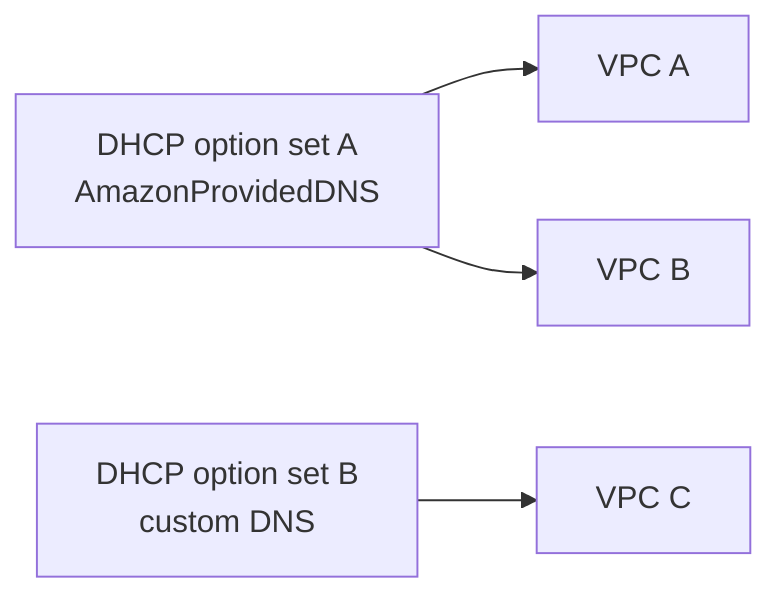

DHCP gives instances and other networked resources the basic settings they need to communicate: IP address, subnet mask, default gateway, DNS configuration, and related options.

In an AWS VPC, some DHCP-provided values are controlled by AWS and others are controlled through DHCP option sets.

## What AWS Controls

You do not configure these values in a DHCP option set:

- Instance private IP allocation.
- Subnet mask.
- Default gateway.

The default gateway is always the VPC router interface in the subnet, which uses the subnet `+1` address.

## DHCP Option Sets

DHCP option sets configure values such as:

- DNS servers.
- Domain name.
- NTP servers.
- NetBIOS name servers.
- NetBIOS node type.

Important rules:

- A DHCP option set can be associated with zero or more VPCs.
- A VPC can have at most one DHCP option set associated.
- DHCP option sets are immutable after creation.
- To change options, create a new option set and associate it with the VPC.
- Existing resources pick up changes after DHCP renewal, not necessarily instantly inside the guest OS.

## AmazonProvidedDNS

`AmazonProvidedDNS` maps to the Route 53 Resolver available in the VPC. It commonly uses the VPC `+2` address behavior.

Example for a VPC using `10.16.0.0/16`:

- VPC router in each subnet is subnet `+1`.
- Amazon DNS behavior is commonly reachable at `10.16.0.2`.

This resolver supports AWS DNS behavior such as private hosted zones and VPC endpoint DNS names when configured.

## DNS Hostnames and DNS Resolution

Two VPC DNS settings matter often:

- DNS resolution: whether DNS queries using the Amazon resolver are supported.
- DNS hostnames: whether instances with public IP addresses can receive public DNS hostnames.

Custom VPCs should usually have both reviewed. DNS settings become especially important when using private hosted zones, VPC endpoints, ECS/EKS service discovery, or hybrid DNS forwarding.

## Security Relevance

- DNS is part of the control plane for workload connectivity.
- Misconfigured DNS can bypass intended private paths.
- Custom DNS servers should be reachable and monitored.
- Hybrid DNS needs clear forwarding rules and logging.
- Private hosted zones can change how names resolve inside a VPC.

## Troubleshooting Prompts

- Which DHCP option set is associated with the VPC?
- Are DNS resolution and DNS hostnames enabled as expected?
- Did the instance renew DHCP after an option set change?
- Are custom DNS servers reachable through route tables and security controls?
- Is a private hosted zone overriding the expected public DNS response?

## AWS References

- [DHCP option sets in Amazon VPC](https://docs.aws.amazon.com/vpc/latest/userguide/VPC_DHCP_Options.html)
- [DNS attributes for your VPC](https://docs.aws.amazon.com/vpc/latest/userguide/vpc-dns.html)
- [Route 53 Resolver](https://docs.aws.amazon.com/Route53/latest/DeveloperGuide/resolver.html)
