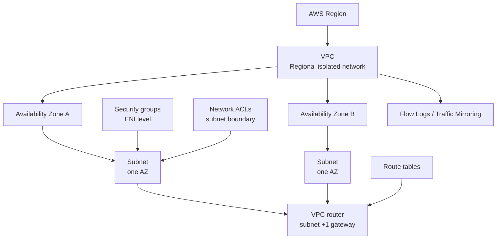

Amazon Virtual Private Cloud (Amazon VPC) lets you create isolated private networks inside AWS. A good VPC design is not just about creating subnets. It is about planning address space, routing, segmentation, access control, observability, and future connectivity before workloads arrive.

## Reading Order

1. [[aws-networking/virtual-private-clouds/public-and-private-aws-networking|Public and Private AWS Networking]]
2. [[aws-networking/virtual-private-clouds/vpc-foundations-and-custom-vpcs|VPC Foundations and Custom VPCs]]
3. [[aws-networking/virtual-private-clouds/vpc-ip-planning-and-cidr-design|VPC IP Planning and CIDR Design]]
4. [[aws-networking/virtual-private-clouds/vpc-subnets-and-availability-zones|VPC Subnets and Availability Zones]]
5. [[aws-networking/virtual-private-clouds/vpc-router-and-route-tables|VPC Router and Route Tables]]
6. [[aws-networking/virtual-private-clouds/public-networking/index|VPC Public Networking Deep Dive]]
7. [[aws-networking/virtual-private-clouds/dhcp-dns-and-option-sets|DHCP, DNS, and Option Sets]]
8. [[aws-networking/virtual-private-clouds/ipv6-in-aws-vpcs|IPv6 in AWS VPCs]]
9. [[aws-networking/virtual-private-clouds/stateful-vs-stateless-firewalls|Stateful vs Stateless Firewalls]]
10. [[aws-networking/virtual-private-clouds/security-groups|Security Groups]]
11. [[aws-networking/virtual-private-clouds/network-acls|Network ACLs]]
12. [[aws-networking/virtual-private-clouds/vpc-flow-logs|VPC Flow Logs]]
13. [[aws-networking/virtual-private-clouds/vpc-traffic-mirroring|VPC Traffic Mirroring]]
14. [[aws-networking/virtual-private-clouds/secure-multi-tier-vpc-reference-architecture|Secure Multi-Tier VPC Reference Architecture]]

## Core Model

## Security Themes

- VPCs provide isolation, but connected VPCs and hybrid links extend the blast radius.
- Subnets provide structure and AZ placement, not complete isolation by themselves.
- Route tables decide where packets go after they leave the local subnet.
- Security groups are stateful controls attached to elastic network interfaces.
- Network ACLs are stateless controls attached at subnet boundaries.
- Flow Logs provide packet metadata for investigation, but not payloads.
- Traffic Mirroring supports packet inspection when metadata is not enough.

## AWS References

- [What is Amazon VPC?](https://docs.aws.amazon.com/vpc/latest/userguide/what-is-amazon-vpc.html)
- [VPC components](https://docs.aws.amazon.com/vpc/latest/userguide/vpc-components.html)
- [Amazon VPC quotas](https://docs.aws.amazon.com/vpc/latest/userguide/amazon-vpc-limits.html)
