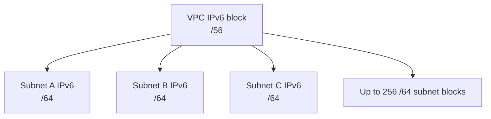
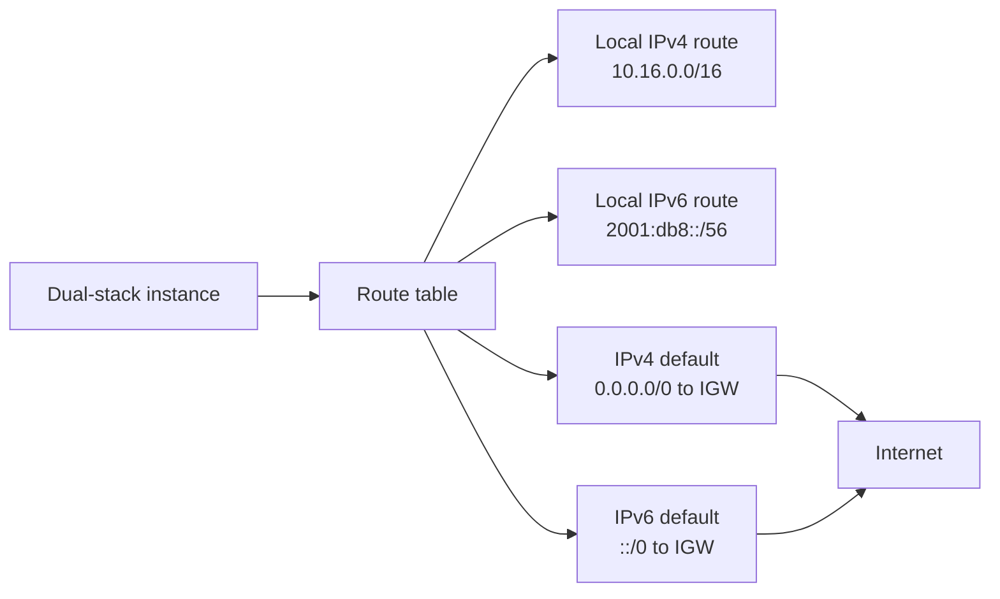

IPv6 changes how VPC addressing feels. IPv4 private address planning is constrained and overlap-prone. IPv6 address space is massive, and AWS-allocated IPv6 ranges are publicly routable.

Publicly routable does not mean reachable from the internet by default. Routing and security controls still decide whether traffic can flow.

## IPv6 Allocation Model

When IPv6 is enabled with an AWS-provided range, AWS allocates a unique `/56` IPv6 CIDR to the VPC. Each IPv6-enabled subnet receives a `/64`.

A `/56` can be split into 256 `/64` subnet ranges. Each `/64` contains an extremely large number of addresses, so subnet design is not about conserving individual IPv6 addresses.

## IPv4 vs IPv6 in VPCs

| Topic                  | IPv4                                 | IPv6                                                           |
| ---------------------- | ------------------------------------ | -------------------------------------------------------------- |
| Typical VPC range      | Private RFC1918 CIDR                 | AWS-provided or BYOIP `/56`                                    |
| Subnet size            | Planned carefully for capacity       | `/64` per subnet                                               |
| NAT                    | Common for private subnet egress     | NAT gateways do not provide IPv6 NAT                           |
| Internet route         | `0.0.0.0/0`                          | `::/0`                                                         |
| Public/private concept | Private IPs plus optional public IPs | Addresses are publicly routable, reachability still controlled |

## Routing

IPv4 and IPv6 routes are separate in the same route table.

Adding `0.0.0.0/0` does not create an IPv6 default route. Adding `::/0` does not create an IPv4 default route.

## Security Implications

- IPv6 workloads do not need NAT to have globally routable source addresses.
- Security groups and NACLs need IPv6 rules if IPv6 is enabled.
- Internet exposure reviews must include `::/0`, not only `0.0.0.0/0`.
- IPv6 can bypass IPv4-only assumptions in firewalls, scanners, and detections.
- Logs and detections should parse IPv6 addresses correctly.

## Design Guidance

- Treat IPv6 as a first-class protocol, not an afterthought.
- Create explicit IPv6 route table and security group standards.
- Include IPv6 in exposure management and asset inventory.
- Use egress-only internet gateways where outbound-only IPv6 internet access is needed.
- Avoid enabling IPv6 casually in environments where controls only inspect IPv4.

## AWS References

- [IPv6 for Amazon VPC](https://docs.aws.amazon.com/vpc/latest/userguide/vpc-migrate-ipv6.html)
- [Add an IPv6 CIDR block to your VPC](https://docs.aws.amazon.com/vpc/latest/userguide/vpc-cidr-blocks.html#vpc-cidr-blocks-ipv6)
- [Egress-only internet gateways](https://docs.aws.amazon.com/vpc/latest/userguide/egress-only-internet-gateway.html)
