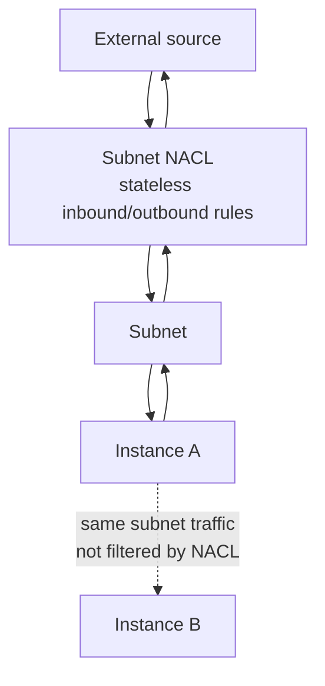
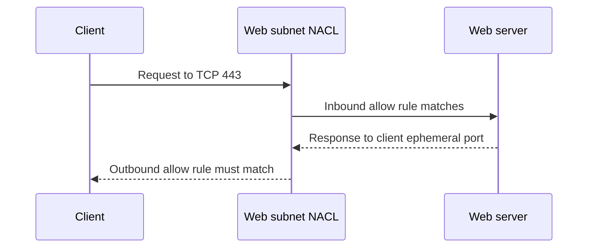

Network ACLs, or NACLs, are stateless packet filters associated with subnets. They apply as traffic enters or leaves a subnet boundary.

Every subnet has an associated NACL. Traffic between two resources in the same subnet does not cross the subnet boundary, so it is not filtered by that subnet's NACL.

## Enforcement Point

## Core Properties

- NACLs are associated with subnets.
- They are stateless.
- They have inbound and outbound rules.
- Rules are evaluated in order by rule number.
- Lower rule numbers are evaluated first.
- They support allow and deny.
- The default final behavior is deny if no rule matches.

## Stateless Rule Design

Because NACLs are stateless, both request and response paths need rules.

Example: allow clients to reach a web subnet on HTTPS.

| Direction | Purpose                   | Example Rule                             |
| --------- | ------------------------- | ---------------------------------------- |
| Inbound   | Client request to server  | Allow TCP `443` from client CIDR         |
| Outbound  | Server response to client | Allow TCP ephemeral ports to client CIDR |

The exact ephemeral range depends on the client operating system and your environment. Broad ephemeral rules are common, but they should be understood rather than copied blindly.

## When NACLs Help

Security groups are usually the primary workload control. NACLs are useful when you need subnet-level guardrails, stateless filtering, or explicit deny behavior.

Good uses:

- Blocking known malicious CIDRs at a subnet boundary.
- Adding coarse subnet-level guardrails.
- Controlling traffic before it reaches workload security groups.
- Supporting regulated segmentation patterns.

Poor uses:

- Managing fine-grained application access for every workload.
- Replacing security groups.
- Building complex allowlists that become impossible to operate.

## Security Group vs NACL

| Feature             | Security Group         | NACL                                |
| ------------------- | ---------------------- | ----------------------------------- |
| Attachment          | ENI                    | Subnet                              |
| State               | Stateful               | Stateless                           |
| Rule type           | Allow only             | Allow and deny                      |
| Evaluation          | All rules considered   | Ordered by rule number              |
| Same-subnet traffic | Can filter ENI traffic | Does not filter same-subnet traffic |

## AWS References

- [Network ACLs](https://docs.aws.amazon.com/vpc/latest/userguide/vpc-network-acls.html)
- [Control traffic to subnets using network ACLs](https://docs.aws.amazon.com/vpc/latest/userguide/create-network-acl.html)
- [Security groups and network ACLs](https://docs.aws.amazon.com/vpc/latest/userguide/VPC_Security.html)
