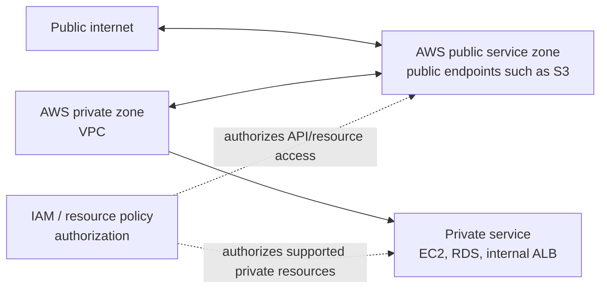

AWS uses the words public and private in a networking sense. Public does not mean unauthenticated, and private does not automatically mean secure.

A public AWS service is reachable through public AWS service endpoints. Amazon S3 is the classic example. You can reach the S3 endpoint from the internet, from an on-premises network with internet access, or from a VPC that has a path to that endpoint. Whether a principal can read an object is still controlled by identity and resource policies.

A private AWS service runs inside a VPC or is exposed only through private network paths. Amazon EC2, Amazon RDS, and many VPC-based endpoints are examples.

## Network Zones

The important separation is:

- Network reachability answers: can packets reach the endpoint?
- Authorization answers: is the caller allowed to perform the action?

You usually need both. A principal might be authorized to call S3 but lack network reachability. Another principal might have network reachability to a public endpoint but no IAM permission.

## Public AWS Service

Public AWS services use public endpoints. This does not mean customer data is public. It means the service endpoint exists in the AWS public network and can be reached from networks with a route to it.

Common examples include:

- Amazon S3
- AWS STS
- IAM
- CloudWatch public APIs
- EventBridge public APIs

Security considerations:

- IAM policy, resource policy, SCPs, and service-specific controls still govern access.
- Public endpoint access can often be constrained with condition keys.
- VPC endpoints can keep traffic to supported AWS services on private AWS network paths.

## Private AWS Service

Private services run inside a VPC or are reachable only through private connectivity. The VPC boundary gives you control over subnets, routing, security groups, NACLs, and private connectivity.

Common examples include:

- EC2 instances
- RDS databases
- ECS tasks using `awsvpc` mode
- EKS pods and nodes
- Internal Application Load Balancers

Security considerations:

- A private IP address is not a security control by itself.
- Connected VPCs, VPNs, Direct Connect, peering, Transit Gateway, and PrivateLink can extend reachability.
- Security groups and NACLs should define which sources are allowed.

## Review Checklist

- [ ] Is the service public by network endpoint, private by VPC placement, or exposed through a VPC endpoint?
- [ ] Is access controlled by IAM, resource policy, network controls, or all three?
- [ ] Does the workload need internet egress, or only AWS service access?
- [ ] Would a VPC endpoint reduce exposure or NAT dependency?
- [ ] Are public endpoints restricted with conditions where possible?

## AWS References

- [Amazon VPC interface endpoints](https://docs.aws.amazon.com/vpc/latest/privatelink/create-interface-endpoint.html)
- [Gateway endpoints for Amazon S3](https://docs.aws.amazon.com/vpc/latest/privatelink/vpc-endpoints-s3.html)
- [AWS global condition context keys](https://docs.aws.amazon.com/IAM/latest/UserGuide/reference_policies_condition-keys.html)
