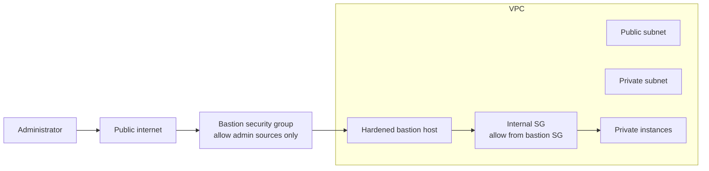
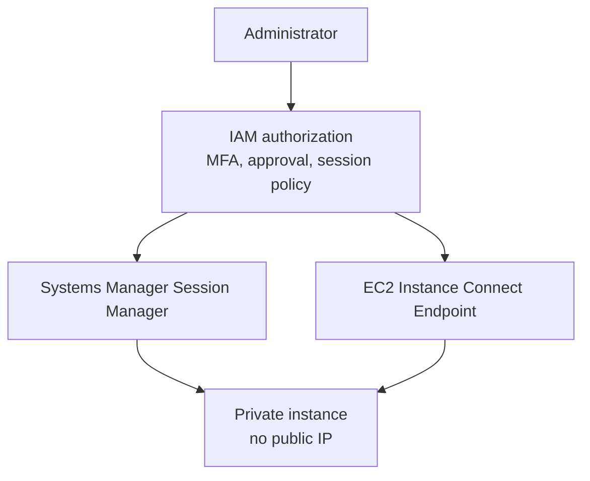

A bastion host is a hardened server placed at the edge between a public network and a private network to provide controlled administrative ingress.

A jumpbox is the more generic idea: a host used to jump between network zones. A bastion host is a specific kind of jumpbox that sits between a public network and a private network and is hardened for that exposure.

## Bastion Pattern

The goal is to avoid exposing every private instance to the internet. Administrators connect to one controlled and logged entry point, then reach private resources from there.

## Characteristics

A bastion host should be:

- Hardened.
- Publicly reachable only from approved sources.
- Logged.
- Monitored.
- Patched aggressively.
- Protected with key-based, federated, or just-in-time access.
- Separated from application roles.

## Demo Pattern as Reference

The transcript demo turns web subnets public, launches an EC2 instance in a public subnet, assigns public IPv4/IPv6 behavior, and creates a security group allowing SSH.

For production, the secure version is stricter:

- Do not allow SSH from `0.0.0.0/0` or `::/0`.
- Restrict source CIDRs or use VPN/private access.
- Prefer short-lived access.
- Log sessions.
- Alert on unexpected source IPs and failed authentication.
- Do not store private keys on the bastion.
- Avoid using the bastion as a general-purpose admin server.

## Modern Alternatives

In many AWS environments, a bastion host should be the exception rather than the default.

Better alternatives often include:

- AWS Systems Manager Session Manager.
- EC2 Instance Connect Endpoint.
- VPN or private connectivity for administration.
- Privileged access workflows with time-bound approvals.

Session Manager can reduce or eliminate the need to open inbound ports, maintain bastions, or manage SSH keys. EC2 Instance Connect Endpoint supports private IP administration without requiring a bastion or direct VPC internet connectivity.

## Security Checklist

- [ ] Bastion has a documented reason to exist.
- [ ] Source access is restricted.
- [ ] MFA or federated access is required where possible.
- [ ] Sessions are logged.
- [ ] Private keys are not stored on the bastion.
- [ ] Internal security groups allow admin access only from the bastion security group.
- [ ] Host patching is automated.
- [ ] Alerts exist for unexpected login attempts.
- [ ] Session Manager or EC2 Instance Connect Endpoint has been evaluated.

## AWS References

- [Connect using Session Manager](https://docs.aws.amazon.com/AWSEC2/latest/UserGuide/connect-with-systems-manager-session-manager.html)
- [AWS Systems Manager Session Manager](https://docs.aws.amazon.com/systems-manager/latest/userguide/session-manager.html)
- [EC2 Instance Connect Endpoint](https://docs.aws.amazon.com/AWSEC2/latest/UserGuide/connect-with-ec2-instance-connect-endpoint.html)
- [EC2 key pairs](https://docs.aws.amazon.com/AWSEC2/latest/UserGuide/ec2-key-pairs.html)
