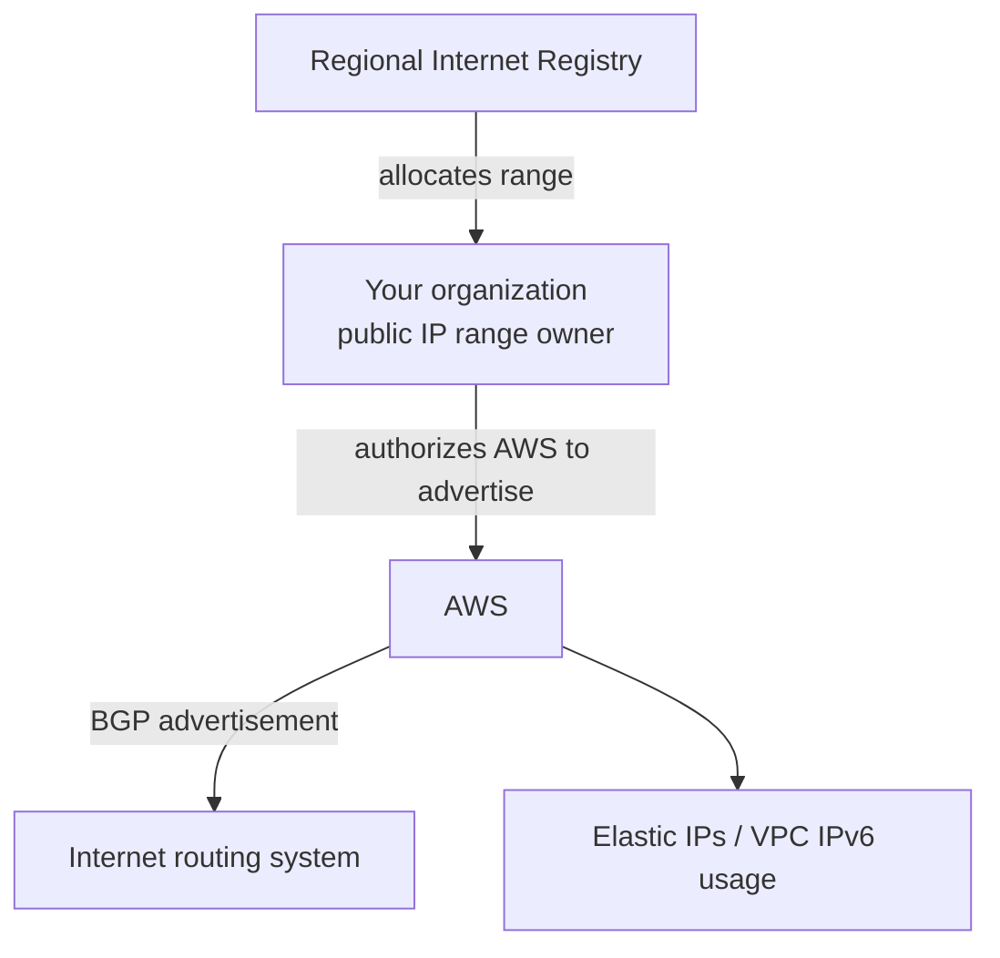

Bring Your Own IP (BYOIP) lets an organization bring public IPv4 or IPv6 address ranges it controls into AWS and use them with supported AWS services.

The core idea is route authority. Public IP ranges are allocated and governed through internet registry systems. AWS can only advertise a range on the public internet when the range owner authorizes AWS to do so.

## AWS-Owned vs Customer-Owned IPs

AWS-owned public IPs are allocated from ranges AWS controls and advertises. You can use them in AWS, but they are not portable to your own network.

Customer-owned IPs are allocated to your organization by a regional internet registry or otherwise controlled by your organization. With BYOIP, you authorize AWS to advertise the range.

## Trust and Authorization

BYOIP is process-heavy because AWS needs proof that the AWS account is authorized to bring in and advertise the range.

The trust model commonly involves:

- Proving control of the IP range.
- Registry records.
- Route origin authorization.
- Resource Public Key Infrastructure (RPKI).
- AWS BGP autonomous system numbers authorized for advertisement.

The transcript describes this as a digital proof workflow: generate keys, prove organizational identity, sign authorization material, and allow AWS to validate that the request is legitimate.

## Why Use BYOIP

Common reasons:

- IP reputation continuity.
- Customer allowlists already depend on existing IP ranges.
- Migration from on-premises or another provider.
- Regulatory or operational need to control address ownership.
- Large-scale public addressing requirements.
- Cleaner firewall rules using contiguous public ranges.

## IPv4 and IPv6 Usage

For IPv4, BYOIP ranges can be used as address pools for Elastic IP addresses.

For IPv6, BYOIP ranges can be associated with VPCs and used by resources in the VPC, depending on AWS support and configuration.

## Security Considerations

- Treat BYOIP authorization material as sensitive.
- Maintain clear ownership and registry hygiene.
- Monitor route advertisements and unexpected reachability.
- Understand which account and Region can use the address pool.
- Include BYOIP ranges in threat intelligence, allowlist, logging, and asset inventory workflows.
- Avoid assuming that "our IP range" means "trusted traffic."

## Related Pattern: Internet Gateway Ingress Routing

For some large public IP pool designs, internet gateway ingress routing can route traffic destined for BYOIP ranges to a specific ENI in a VPC. This is useful for network appliances and large-scale public address handling.

## AWS References

- [Amazon EC2 instance IP addressing](https://docs.aws.amazon.com/AWSEC2/latest/UserGuide/using-instance-addressing.html)
- [Elastic IP addresses](https://docs.aws.amazon.com/AWSEC2/latest/UserGuide/elastic-ip-addresses-eip.html)
- [Internet gateway ingress routing](https://docs.aws.amazon.com/vpc/latest/userguide/igw-ingress-routing.html)
