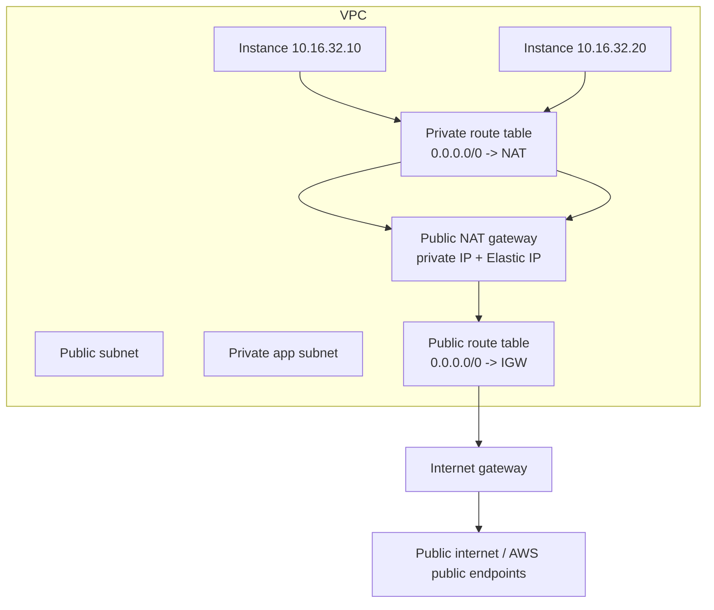
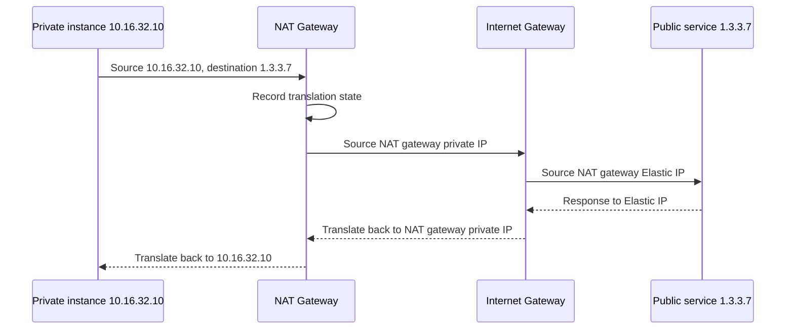
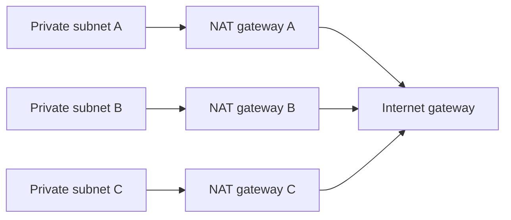

A NAT gateway is the recommended AWS-managed service for giving private subnet resources outbound access without allowing unsolicited inbound connections from the destination network.

For typical public internet egress, a public NAT gateway sits in a public subnet, uses an Elastic IP address, and sends traffic onward through the VPC internet gateway.

## Public NAT Gateway Pattern

Important points:

- The NAT gateway is placed in a public subnet.
- Private subnet route tables point `0.0.0.0/0` at the NAT gateway.
- The NAT gateway subnet route table points `0.0.0.0/0` at the internet gateway.
- The NAT gateway needs an Elastic IP address when it is a public NAT gateway.
- External systems see the NAT gateway's public IPv4 address, not the private instance address.

## Translation Flow

The NAT gateway tracks connection state so it can map response traffic back to the correct private source.

## Resiliency Pattern

Use one NAT gateway per Availability Zone for production resiliency. Route private subnets to the NAT gateway in the same AZ when practical.

If several AZs share one NAT gateway and that NAT gateway's AZ has a problem, private subnets in other AZs can lose internet egress.

## IPv6 Nuance

Native IPv6 does not need IPv4-style NAT. For outbound-only native IPv6 access, use an egress-only internet gateway.

Modern AWS NAT gateways can also support IPv6-to-IPv4 egress with DNS64/NAT64 patterns. Treat that as a specific translation design, not the default answer for native IPv6 internet access.

## Security Considerations

- NAT hides private source addresses from the public internet, but it does not inspect application intent.
- Private subnets with NAT egress can still exfiltrate data.
- Restrict egress with security groups, NACLs, network firewalling, proxy controls, or endpoint-first designs where needed.
- Prefer VPC endpoints for supported AWS services to avoid unnecessary public-path egress.
- Monitor NAT gateway bytes, connection errors, and destination patterns.

## AWS References

- [NAT gateways](https://docs.aws.amazon.com/vpc/latest/userguide/vpc-nat-gateway.html)
- [NAT gateway basics](https://docs.aws.amazon.com/vpc/latest/userguide/nat-gateway-basics.html)
- [VPC with private subnets and NAT](https://docs.aws.amazon.com/vpc/latest/userguide/vpc-example-private-subnets-nat.html)
