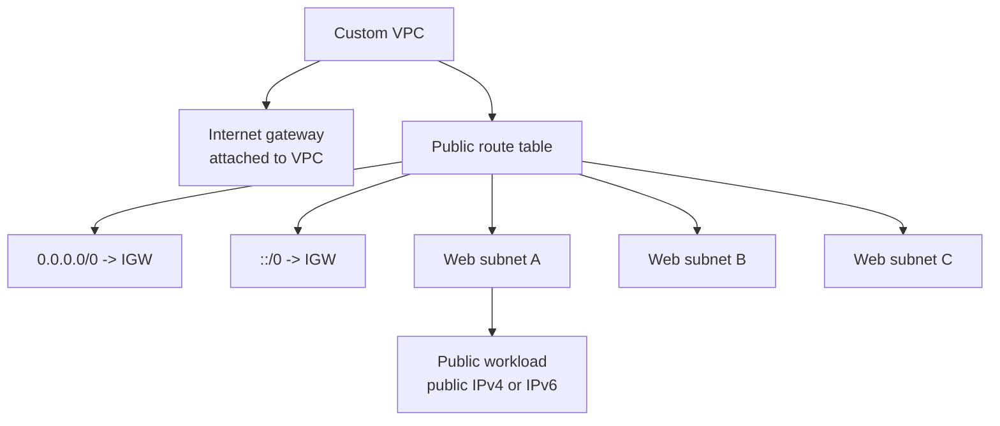

A public subnet is a subnet with route table behavior that sends public internet or AWS public zone traffic to an internet gateway.

In a custom VPC, this is not created automatically. You intentionally create and attach the internet gateway, create or update route tables, associate public subnets, and decide whether workloads receive public IPv4 and IPv6 addresses.

## Public Subnet Construction

The common implementation pattern:

1. Create an internet gateway.
2. Attach it to the VPC.
3. Create a public route table.
4. Add `0.0.0.0/0` to the internet gateway for IPv4 internet-bound traffic.
5. Add `::/0` to the internet gateway for IPv6 internet-bound traffic when IPv6 internet access is intended.
6. Associate the public route table with the public subnets.
7. Ensure workloads have public IPv4 addresses, Elastic IP addresses, or IPv6 addresses as appropriate.
8. Apply security groups and NACLs that match the intended exposure.

## Addressing Requirements

For IPv4, route table configuration is not enough. The workload needs a public IPv4 address or Elastic IP address associated with its private IPv4 address. The internet gateway performs the public/private translation.

For IPv6, a workload with a globally routable IPv6 address can use the internet gateway when the subnet route table points IPv6 traffic to it. There is no IPv4-style public/private NAT behavior.

## Public Subnet Does Not Mean Public Workload

A subnet can have a public route table, but a workload still might not be reachable.

Examples:

- No public IPv4 address is assigned.
- Security group denies inbound traffic.
- NACL denies inbound or response traffic.
- IPv6 is not assigned.
- Host firewall denies traffic.

That said, public subnets should still be treated as internet-edge network zones. They should contain only resources intentionally designed for public or controlled ingress.

## Demo Pattern as Reference

The transcript demo converts three web-tier subnets into public subnets:

- Web A
- Web B
- Web C

Those subnets share a public route table with default IPv4 and IPv6 routes to the internet gateway. A test EC2 instance launched into Web A receives public addressing and can be reached through controlled ingress.

For production, avoid using a broad SSH rule such as `0.0.0.0/0` or `::/0`. Restrict administrative access or use Session Manager / EC2 Instance Connect Endpoint instead.

## Security Checklist

- [ ] Public route table is associated only with intended public subnets.
- [ ] `0.0.0.0/0` to IGW is intentional.
- [ ] `::/0` to IGW is intentional.
- [ ] Public IPv4 auto-assign is disabled unless there is a reason.
- [ ] Public IPv6 assignment is reviewed separately.
- [ ] Inbound security group rules are scoped.
- [ ] VPC Flow Logs are enabled for public subnets.
- [ ] Public ingress points have ownership, logging, and alerting.

## AWS References

- [Internet gateway basics](https://docs.aws.amazon.com/vpc/latest/userguide/VPC_Internet_Gateway.html)
- [Add internet access to a subnet](https://docs.aws.amazon.com/vpc/latest/userguide/working-with-igw.html)
- [Route tables for your VPC](https://docs.aws.amazon.com/vpc/latest/userguide/VPC_Route_Tables.html)
