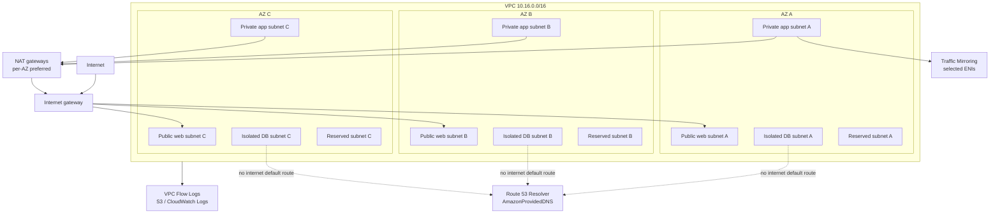
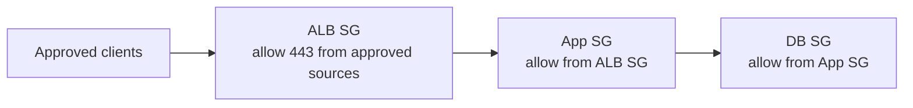
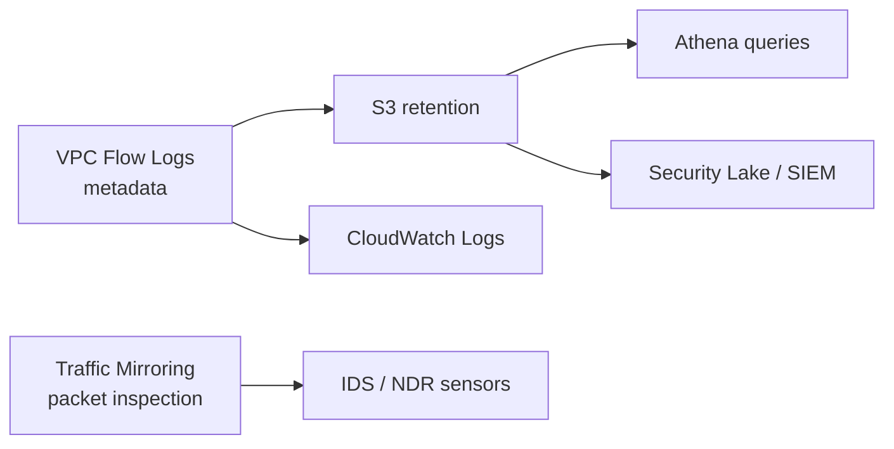

A secure multi-tier VPC separates ingress, application, data, and reserved capacity across Availability Zones. The design goal is not to make the diagram pretty. It is to make reachability, blast radius, and investigation paths predictable.

## Reference Layout

## Tiering Model

| Tier          | Typical Subnet Type    | Purpose                                       |
| ------------- | ---------------------- | --------------------------------------------- |
| Web / ingress | Public                 | ALB, edge proxies, tightly controlled ingress |
| Application   | Private                | ECS/EKS/EC2 application workloads             |
| Database      | Isolated               | RDS, caches, sensitive backend services       |
| Reserved      | No workload by default | Future AZ/tier expansion                      |

## Route Table Model

| Route Table | Associated Subnets | Default Route                                   |
| ----------- | ------------------ | ----------------------------------------------- |
| Public      | Web subnets        | Internet gateway                                |
| Private     | App subnets        | NAT gateway, inspection path, or private egress |
| Isolated    | DB subnets         | No internet default route                       |
| Reserved    | Reserved subnets   | No default route until needed                   |

Private subnets are not automatically secure. They often have outbound internet access through NAT. Treat NAT egress as a meaningful exposure path.

## Security Group Model

Preferred pattern:

- Use workload-to-workload security group references.
- Avoid database access from broad CIDRs.
- Use narrow outbound rules for sensitive workloads when practical.
- Keep descriptions and ownership metadata on rules.

## NACL Model

Use NACLs as subnet guardrails, not as the primary application policy engine.

Good uses:

- Explicitly deny known bad CIDRs.
- Add coarse controls around high-risk subnets.
- Separate blast radius between subnet classes.

Be careful with:

- Ephemeral ports.
- Rule ordering.
- Same-subnet traffic assumptions.
- Overly complex rules that no one can safely maintain.

## Observability Model

Baseline:

- Enable Flow Logs for production VPCs.
- Send long-term logs to S3.
- Query with Athena or central analytics.
- Consider Traffic Mirroring for crown-jewel workloads or targeted investigations.
- Include IPv6 fields and rules if IPv6 is enabled.

## Implementation Checklist

- [ ] CIDR ranges do not overlap with known AWS, on-premises, partner, or multi-cloud networks.
- [ ] VPC size supports planned AZ and tier growth.
- [ ] Subnets are named consistently by environment, tier, and AZ.
- [ ] Public subnets contain only resources intended to be public entry points.
- [ ] Private subnets have explicit egress design.
- [ ] Isolated subnets have no internet default route.
- [ ] Route tables are tier-specific.
- [ ] Security groups use references for service-to-service access.
- [ ] NACLs are simple, documented, and tested.
- [ ] DNS resolution and DHCP option set behavior are understood.
- [ ] IPv6 is either intentionally enabled with controls or intentionally disabled.
- [ ] Flow Logs are enabled and delivered to monitored destinations.
- [ ] Packet inspection requirements are mapped to Traffic Mirroring or appliance patterns.

## AWS References

- [Amazon VPC documentation](https://docs.aws.amazon.com/vpc/)
- [VPC security best practices](https://docs.aws.amazon.com/vpc/latest/userguide/vpc-security-best-practices.html)
- [VPC Flow Logs](https://docs.aws.amazon.com/vpc/latest/userguide/flow-logs.html)
