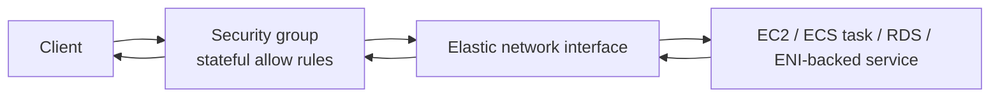
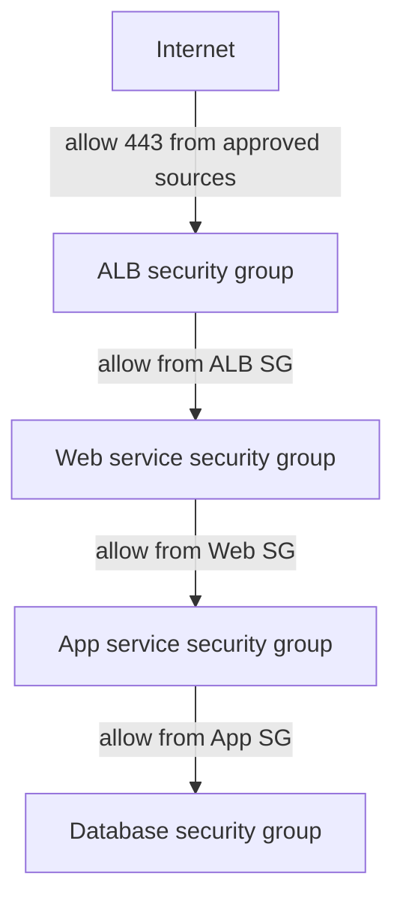

Security groups are stateful virtual firewalls attached to elastic network interfaces (ENIs). The console often makes it feel like a security group is attached to an EC2 instance, but technically it is attached to the instance network interface.

Because many AWS services use ENIs, security groups apply beyond EC2. They are central to VPC-based workload security.

## Enforcement Point

## Core Properties

- Security groups are stateful.
- They allow traffic; they do not explicitly deny traffic.
- They evaluate inbound and outbound rules.
- They can reference CIDR ranges.
- They can reference other security groups.
- They can reference themselves for intra-group communication.
- Multiple security groups can attach to the same ENI.

If any attached security group allows the traffic, the traffic is allowed, assuming routing and other controls also permit it.

## Security Group References

Security group references are powerful because they describe allowed relationships between workloads instead of hard-coding IP ranges.

Example pattern:

- ALB security group allows inbound `443` from approved sources.
- Web service security group allows inbound from the ALB security group.
- App service security group allows inbound from the web security group.
- Database security group allows inbound from the app security group.

This design survives IP address changes better than CIDR-only rules.

## Limitations

Security groups cannot block a subset of an allowed range. If a security group allows `0.0.0.0/0` to TCP `443`, you cannot add a deny rule for one bad IP. Use a NACL, AWS WAF, firewall appliance, or another control for explicit deny behavior.

## Secure Defaults

- Avoid broad inbound rules except at intentional ingress points.
- Prefer security group references for east-west workload access.
- Keep database security groups tightly scoped.
- Review outbound rules; default allow-all egress is often too broad for sensitive workloads.
- Use descriptions that explain why a rule exists.
- Automate stale and overly broad rule detection.

## Troubleshooting Prompts

- Which ENI has the security group attached?
- Are multiple security groups attached?
- Does any attached SG allow the traffic?
- Is return traffic expected to be allowed statefully?
- Is a NACL or route table blocking the traffic instead?

## AWS References

- [Security groups for your VPC](https://docs.aws.amazon.com/vpc/latest/userguide/vpc-security-groups.html)
- [Security group rules](https://docs.aws.amazon.com/vpc/latest/userguide/security-group-rules.html)
- [Connection tracking](https://docs.aws.amazon.com/vpc/latest/userguide/security-group-connection-tracking.html)
