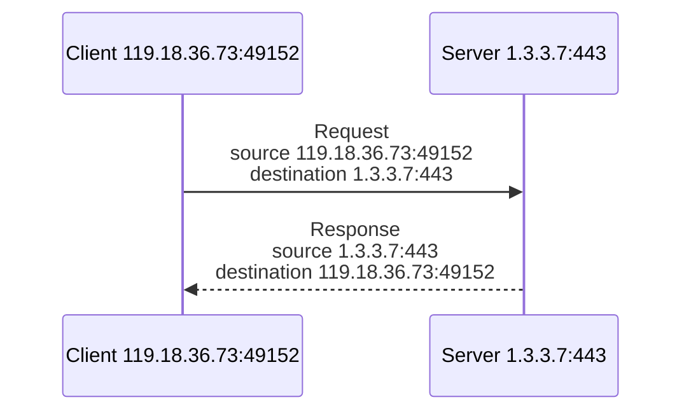
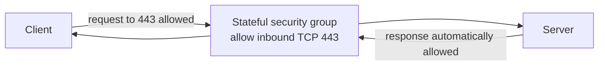
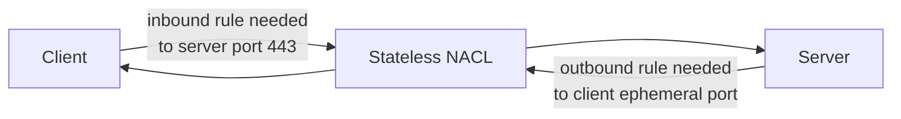

AWS VPC security controls make much more sense when you understand stateful and stateless filtering.

A TCP connection is not just "client connects to server." At the packet level, there is request traffic and response traffic. The request usually goes from a client ephemeral port to a server well-known port. The response returns from the server well-known port to the client ephemeral port.

## TCP Request and Response

The ephemeral port range varies by operating system, but the idea is consistent: the client picks a temporary source port, and the server responds to that temporary port.

## Stateful Filtering

A stateful firewall tracks connection state. If it allows the request part of a connection, it automatically allows the corresponding response traffic.

AWS security groups are stateful.

This makes security group rules simpler. You do not need to separately allow ephemeral response traffic for a connection that the security group already allowed.

## Stateless Filtering

A stateless firewall does not track connection state. It evaluates request and response packets independently.

AWS Network ACLs are stateless.

With stateless controls, you need rules for both directions. If you allow inbound HTTPS to a web subnet, you also need outbound rules that allow the response traffic back to the client ephemeral port range.

## Comparison

| Feature                                | Stateful       | Stateless     |
| -------------------------------------- | -------------- | ------------- |
| Tracks connection state                | Yes            | No            |
| Response traffic automatically allowed | Yes            | No            |
| Needs request and response rules       | Usually no     | Yes           |
| AWS example                            | Security group | Network ACL   |
| Explicit deny support                  | No for SGs     | Yes for NACLs |

## Security Relevance

- Stateful controls are easier to manage at workload level.
- Stateless controls can explicitly block traffic, but rules are easier to get wrong.
- Ephemeral port handling is a common NACL troubleshooting issue.
- A packet can pass routing but still fail filtering.

## Review Prompts

- Is this control stateful or stateless?
- Do I need rules for return traffic?
- Are ephemeral ports allowed where required?
- Am I trying to use a security group for explicit deny?
- Am I using a NACL to block something that a security group cannot block?
