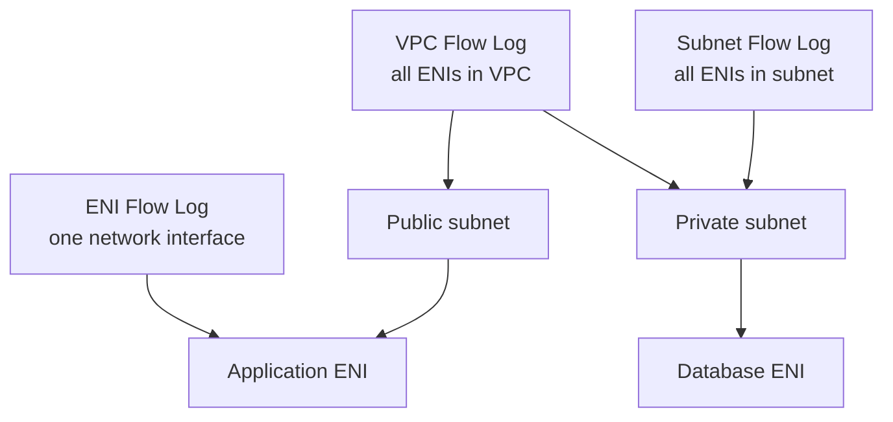
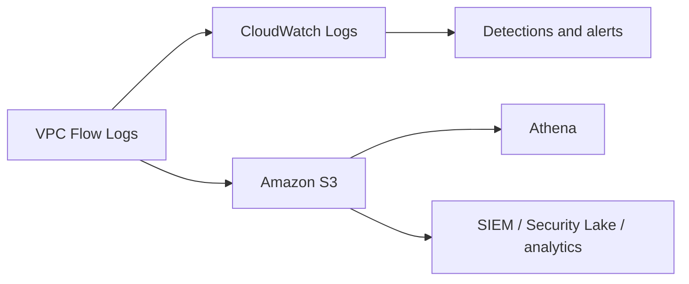

VPC Flow Logs capture network traffic metadata for VPC resources. They do not capture packet payloads.

Flow Logs are useful for detection, troubleshooting, network baselining, incident response, and validating security group or NACL behavior.

## What Flow Logs Capture

Flow Logs capture metadata such as:

- Source IP.
- Destination IP.
- Source port.
- Destination port.
- Protocol.
- Packet and byte counts.
- Action, such as accept or reject.
- Interface ID.
- Timestamps.

They do not capture:

- Packet contents.
- HTTP headers.
- TLS payloads.
- Full packet streams.

Use Traffic Mirroring or packet capture tooling when payload inspection is required.

## Capture Scope

Flow Logs can be enabled at multiple levels:

VPC-level logging gives broad coverage. Subnet-level logging focuses on a network zone. ENI-level logging focuses on a specific workload interface.

## Destinations

Common destinations:

- Amazon CloudWatch Logs.
- Amazon S3.

CloudWatch Logs is convenient for operational workflows, metric filters, dashboards, and alerting. S3 is useful for long-term retention, Athena queries, data lake workflows, and integration with security analytics platforms.

## Capture Mode

Flow Logs can capture:

- Accepted traffic.
- Rejected traffic.
- All traffic.

Rejected-only logs are useful for blocked-traffic troubleshooting. All traffic is better for investigation and baselining, but it costs more and produces more data.

## Security Use Cases

- Identify unexpected east-west traffic.
- Detect public exposure attempts.
- Investigate rejected connections.
- Validate NACL and security group changes.
- Find workloads talking to unexpected destinations.
- Support incident response scoping.
- Query long-term network history with Athena.

## Limitations

- Flow Logs are not real time.
- They capture metadata only.
- They do not prove application-layer intent.
- Some AWS-managed traffic may be represented differently than expected.
- Missing logs can be a scope, permission, destination, or aggregation issue.

## AWS References

- [VPC Flow Logs](https://docs.aws.amazon.com/vpc/latest/userguide/flow-logs.html)
- [Flow log records](https://docs.aws.amazon.com/vpc/latest/userguide/flow-log-records.html)
- [Query flow logs using Athena](https://docs.aws.amazon.com/vpc/latest/userguide/flow-logs-athena.html)
