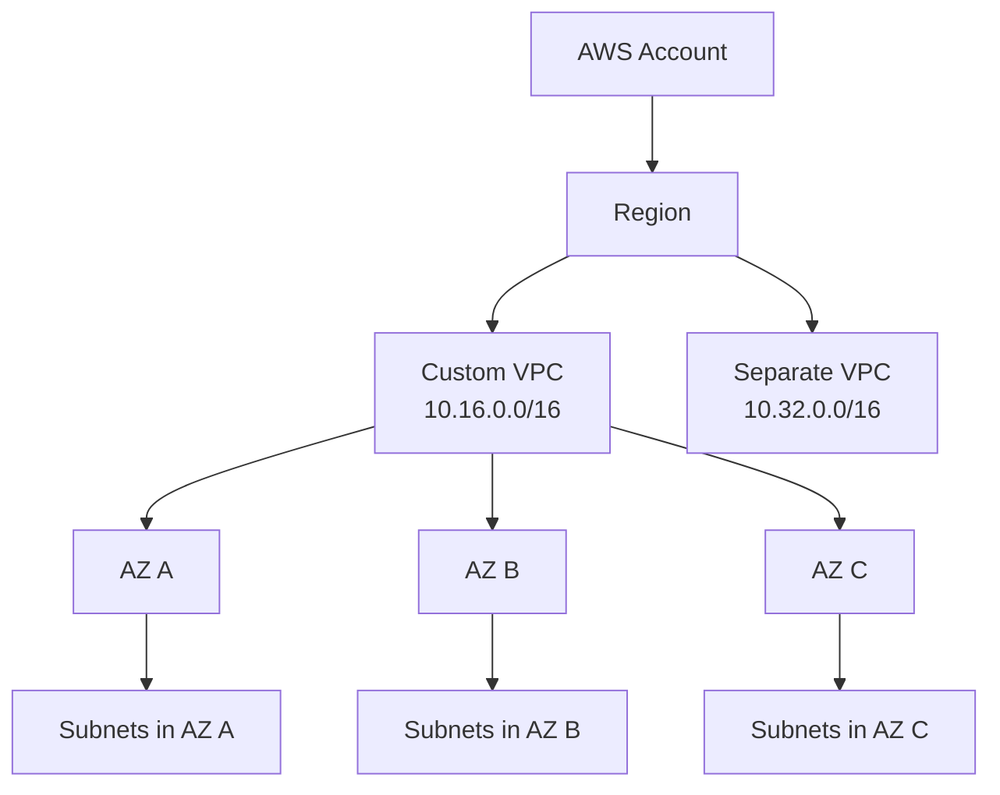

A VPC is a regional private network boundary inside AWS. It is created in one Region, spans the Availability Zones in that Region, and gives you control over IP ranges, subnets, routing, DNS behavior, and network security controls.

Nothing enters or leaves a VPC unless you configure a path. That path might be an internet gateway, NAT gateway, VPC peering connection, Transit Gateway, VPN, Direct Connect, PrivateLink, or another supported connectivity construct.

## Default VPC vs Custom VPC

Default VPCs are convenient. They are created with a standard structure, default subnets, a main route table, internet connectivity, and permissive defaults for getting started.

Custom VPCs are intentional. They let you decide:

- Which CIDR ranges to use.
- How many Availability Zones to design for.
- Which subnet tiers to create.
- Which subnets are public, private, isolated, or reserved.
- Which route tables and gateways exist.
- Which DNS and DHCP settings apply.
- Which network security controls are attached.

For production environments, custom VPCs are almost always the right starting point.

## VPC Scope

Key points:

- A VPC is regional, not zonal.
- A subnet is zonal, not regional.
- A single account can contain multiple isolated VPCs.
- VPC isolation is strongest until you connect the VPC to something else.

## Tenancy

When creating a VPC, you can choose default or dedicated tenancy.

Default tenancy lets most resources run on shared AWS hardware, while still allowing resource-level dedicated options where supported.

Dedicated tenancy at the VPC level forces supported resources in that VPC onto dedicated hardware. This can be expensive and restrictive. Use it only for a clear compliance or licensing requirement.

## DNS Settings

Custom VPCs commonly need DNS settings checked after creation:

- DNS resolution should usually be enabled.
- DNS hostnames are often needed when instances with public IPs should receive public DNS names.
- AmazonProvidedDNS normally maps to the Route 53 Resolver for the VPC.

These settings matter for service discovery, private hosted zones, VPC endpoints, and workload troubleshooting.

## Security Design Notes

- Treat each VPC as a blast-radius boundary.
- Keep production, shared services, sandbox, and high-risk workloads separated when appropriate.
- Avoid relying on default VPCs for long-lived infrastructure.
- Decide how the VPC will connect to shared services, inspection, logging, and hybrid networks before workloads depend on it.

## AWS References

- [Create a VPC](https://docs.aws.amazon.com/vpc/latest/userguide/create-vpc.html)
- [Default VPCs](https://docs.aws.amazon.com/vpc/latest/userguide/default-vpc.html)
- [VPC DNS support](https://docs.aws.amazon.com/vpc/latest/userguide/vpc-dns.html)
