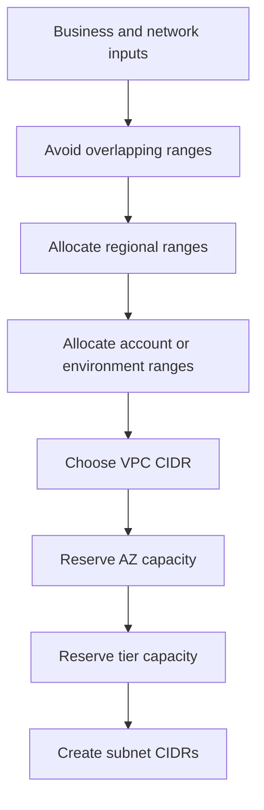
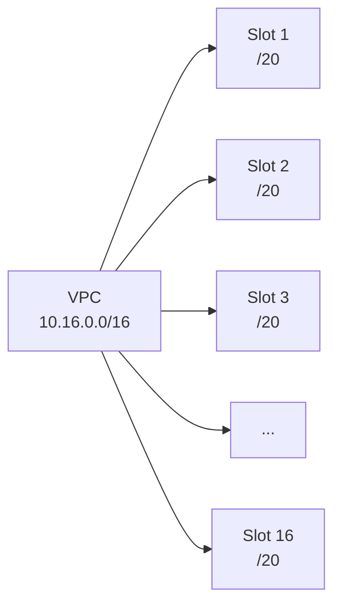

IP planning is one of the hardest VPC decisions to fix later. Route tables, hybrid connectivity, VPC peering, Transit Gateway, migration projects, partner links, and multi-cloud connectivity all become harder when address ranges overlap.

The goal is to choose address space that can support the current design, future growth, and connectivity to networks you do not fully control.

## Planning Inputs

Start by identifying networks that already exist or might need connectivity:

- Existing AWS VPCs.
- Other cloud environments.
- On-premises networks.
- VPN client pools.
- Partner and vendor networks.
- Lab, sandbox, and acquisition networks.
- Common ranges that many companies already use, such as `10.0.0.0/16`, `172.31.0.0/16`, and `192.168.0.0/24` style ranges.

If two networks use overlapping CIDRs, normal routing cannot cleanly distinguish between them. Avoiding overlap is much easier than compensating for it later.

## Address Planning Pattern

## Sizing Method

A practical method is to decide the subnet grid before choosing the final VPC size.

Common production pattern:

- 3 active Availability Zones.
- 1 reserved future Availability Zone.
- 3 active tiers: web, application, database.
- 1 reserved future tier.

That creates a 4 x 4 grid, or 16 subnet slots.

If the VPC is a `/16`, splitting it into 16 equal subnet slots gives `/20` subnets.

The prefix math:

| VPC CIDR | 16 Equal Subnets | Approximate Usable IPv4 Per Subnet |
| -------- | ---------------: | ---------------------------------: |
| `/16`    |            `/20` |                               4091 |
| `/17`    |            `/21` |                               2043 |
| `/18`    |            `/22` |                               1019 |
| `/19`    |            `/23` |                                507 |
| `/20`    |            `/24` |                                251 |

AWS reserves five IPv4 addresses in every subnet, so usable capacity is lower than raw CIDR math.

## Design Guidance

- Use ranges that are unlikely to overlap with future networks.
- Leave gaps for expansion.
- Reserve capacity for future AZs and tiers.
- Keep subnet naming and numbering predictable.
- Avoid making every subnet tiny just because the first workload is small.
- Avoid consuming an entire private range with one design unless there is a clear reason.

## Security Relevance

Good IP planning supports security operations:

- Cleaner route tables.
- Easier segmentation.
- Easier incident scoping.
- Easier VPC Flow Logs analysis.
- Easier network ACL and firewall rule design.
- Less accidental exposure during mergers, migrations, and hybrid connectivity projects.

## AWS References

- [VPC CIDR blocks](https://docs.aws.amazon.com/vpc/latest/userguide/vpc-cidr-blocks.html)
- [Subnet sizing for IPv4](https://docs.aws.amazon.com/vpc/latest/userguide/subnet-sizing.html)
- [Amazon VPC quotas](https://docs.aws.amazon.com/vpc/latest/userguide/amazon-vpc-limits.html)
