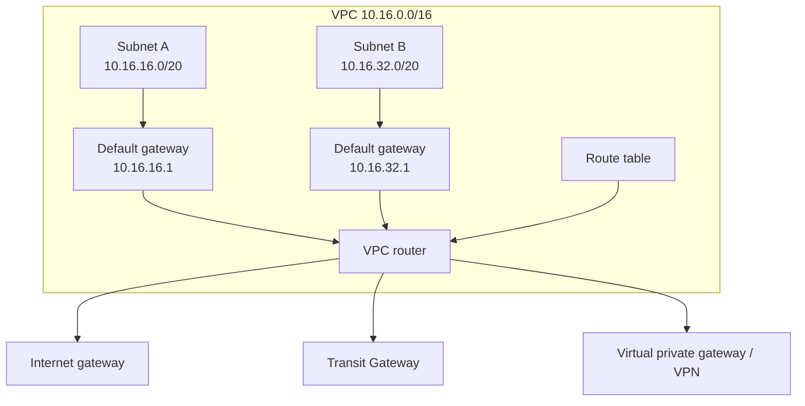

Every VPC has a logical VPC router. It routes traffic between subnets and toward configured gateways or connected networks. You do not manage the router as an appliance. You control its behavior with route tables.

The VPC router has an interface in every subnet. That interface uses the subnet `+1` address and is provided to resources as their default gateway.

## Router Model

## Route Tables

Each subnet is associated with one route table. If you do not explicitly associate a subnet with a custom route table, it uses the VPC main route table.

Route tables contain routes with:

- Destination CIDR.
- Target.

Common targets include:

- `local` for VPC CIDR communication.
- Internet gateway.
- NAT gateway.
- Transit Gateway.
- VPC peering connection.
- Gateway Load Balancer endpoint.
- Virtual private gateway.
- Network interface.

## Main vs Custom Route Tables

Every VPC has a main route table. It is the default route table for subnets without an explicit association.

Custom route tables are usually better for production because they let you define specific behavior for public, private, isolated, inspection, or appliance subnets.

Common pattern:

| Route Table | Associated Subnets            | Default Route                          |
| ----------- | ----------------------------- | -------------------------------------- |
| Public      | Public web or ingress subnets | Internet gateway                       |
| Private     | App or worker subnets         | NAT gateway or inspection path         |
| Isolated    | Database or sensitive subnets | No internet default route              |
| Inspection  | Firewall or appliance subnets | Gateway Load Balancer / appliance path |

## Routing Rules

Route selection uses the most specific matching route.

Example:

| Destination    | Target          |
| -------------- | --------------- |
| `10.16.0.0/16` | `local`         |
| `10.32.0.0/16` | Transit Gateway |
| `0.0.0.0/0`    | NAT gateway     |

Traffic to `10.32.10.50` matches `10.32.0.0/16` before the default route.

## Security Relevance

- Route tables define reachability.
- Security groups and NACLs define filtering.
- A private subnet can still have broad outbound reachability through NAT.
- A missing or incorrect route can look like a firewall problem.
- A route to a connected network extends the VPC blast radius.

## Troubleshooting Prompts

- Is the source subnet associated with the expected route table?
- Does the destination match a more specific route?
- Is the target available and healthy?
- Is return routing symmetric enough for the flow?
- Are security groups or NACLs blocking traffic after routing succeeds?

## AWS References

- [Route tables for your VPC](https://docs.aws.amazon.com/vpc/latest/userguide/VPC_Route_Tables.html)
- [Route priority](https://docs.aws.amazon.com/vpc/latest/userguide/route-tables-priority.html)
- [Internet gateways](https://docs.aws.amazon.com/vpc/latest/userguide/VPC_Internet_Gateway.html)
