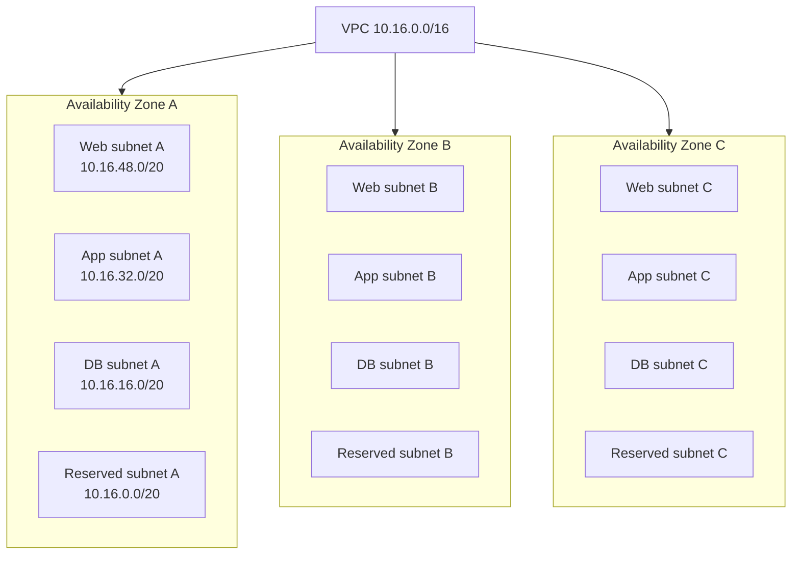

Subnets are where VPC resources actually run. You create a VPC as the network boundary, but EC2 instances, ECS tasks using `awsvpc`, RDS instances, load balancers, and many other resources attach to subnets.

A subnet belongs to exactly one Availability Zone. One Availability Zone can contain many subnets.

## Subnet Purpose

Subnets give a VPC structure:

- Placement across Availability Zones.
- Separation by tier or function.
- Different route table associations.
- Different network ACL associations.
- Different public, private, or isolated behavior.

## Public, Private, and Isolated

A subnet being public or private is mainly a routing outcome.

| Subnet Type | Typical Route Behavior                                 | Common Use                             |
| ----------- | ------------------------------------------------------ | -------------------------------------- |
| Public      | Has a default route to an internet gateway             | Public ALB, bastion, edge services     |
| Private     | Has outbound route through NAT or private connectivity | App tier, ECS tasks, workers           |
| Isolated    | No default route to internet                           | Databases, sensitive internal services |

A subnet does not become public just because an instance has a public IP. It needs the right routing path too. Likewise, a subnet can contain resources with no public IP even if the subnet route table has internet gateway access.

## Reserved IPv4 Addresses

AWS reserves five IPv4 addresses in every subnet:

| Address Position  | Purpose                                            |
| ----------------- | -------------------------------------------------- |
| Network address   | Identifies the subnet                              |
| Subnet `+1`       | VPC router default gateway                         |
| Subnet `+2`       | Amazon DNS, when AmazonProvidedDNS is used         |
| Subnet `+3`       | Reserved for future use                            |
| Broadcast address | Reserved even though VPCs do not support broadcast |

Example for `10.16.16.0/20`:

- `10.16.16.0` is the network address.
- `10.16.16.1` is the VPC router interface.
- `10.16.16.2` is used for Amazon DNS behavior.
- `10.16.16.3` is reserved.
- `10.16.31.255` is reserved as the broadcast address.

## Design Guidance

- Duplicate critical tiers across at least three Availability Zones when the workload requires high availability.
- Keep subnet naming consistent: environment, tier, AZ, and purpose.
- Separate public entry components from private application and database tiers.
- Leave reserved capacity for future tiers or AZ expansion.
- Avoid placing unrelated trust zones in the same subnet when different NACLs or route behavior are needed.

## AWS References

- [VPC subnets](https://docs.aws.amazon.com/vpc/latest/userguide/configure-subnets.html)
- [Subnet sizing](https://docs.aws.amazon.com/vpc/latest/userguide/subnet-sizing.html)
- [Availability Zones](https://docs.aws.amazon.com/AWSEC2/latest/UserGuide/using-regions-availability-zones.html)
