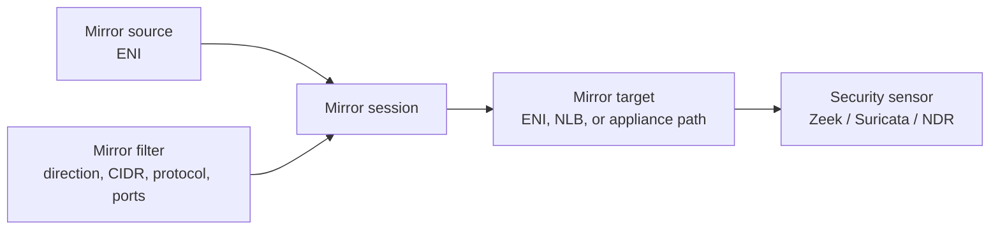
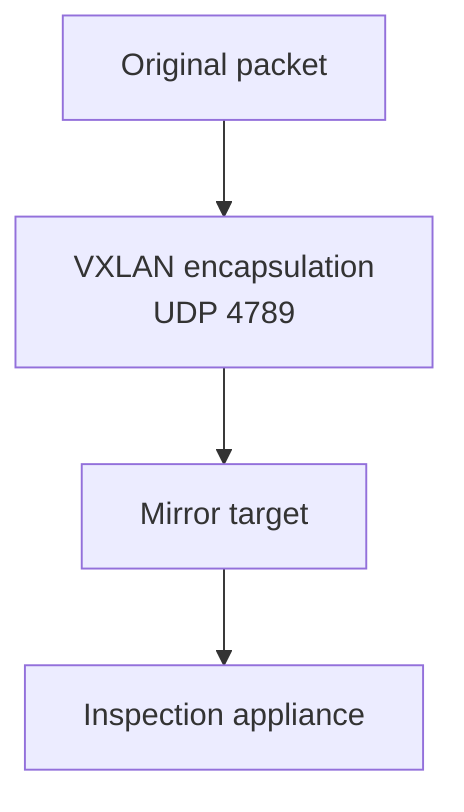

VPC Traffic Mirroring copies network traffic from supported elastic network interfaces to monitoring appliances. It is used when metadata is not enough and packet-level inspection is required.

Common use cases:

- Threat detection.
- Network forensics.
- IDS and NDR tooling.
- Protocol analysis.
- Troubleshooting complex flows.

## Components

Traffic Mirroring has four main components:

- Source: the ENI whose traffic is mirrored.
- Target: where mirrored traffic is delivered.
- Filter: which traffic should be mirrored.
- Session: ties the source, target, and filter together.

## Encapsulation

Mirrored traffic is encapsulated so the original packet can be delivered to the target without modifying the original flow. VPC Traffic Mirroring uses VXLAN encapsulation over UDP port `4789`.

The mirror target security group and any intermediate network controls must allow the encapsulated traffic.

## Placement Patterns

Targets can be in the same VPC or a different VPC, and can be in the same or different account, but the source and target must be in the same Region.

Common patterns:

- Mirror selected high-risk workload ENIs to a local sensor.
- Mirror subnet representative traffic to an appliance fleet.
- Send mirrored traffic to a Network Load Balancer distributing to sensors.
- Centralize inspection targets in a security tooling account.

## Security Considerations

- Mirrored traffic can contain sensitive data.
- Access to mirror sessions and targets should be tightly controlled.
- Filters should be scoped to the traffic needed for the use case.
- Packet inspection should be paired with privacy and retention controls.
- Mirroring does not replace Flow Logs; it answers a different question.

## Troubleshooting Prompts

- Is the source ENI supported?
- Does the mirror session reference the correct source, target, and filter?
- Does the filter match the traffic direction and protocol?
- Can the source route to the target?
- Does the target allow UDP `4789`?
- Is the inspection appliance decoding VXLAN correctly?

## AWS References

- [VPC Traffic Mirroring](https://docs.aws.amazon.com/vpc/latest/mirroring/what-is-traffic-mirroring.html)
- [Traffic Mirroring concepts](https://docs.aws.amazon.com/vpc/latest/mirroring/traffic-mirroring-concepts.html)
- [Traffic Mirroring considerations](https://docs.aws.amazon.com/vpc/latest/mirroring/traffic-mirroring-considerations.html)
