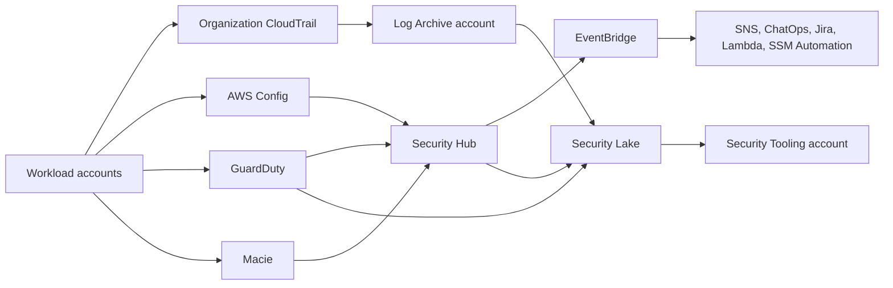
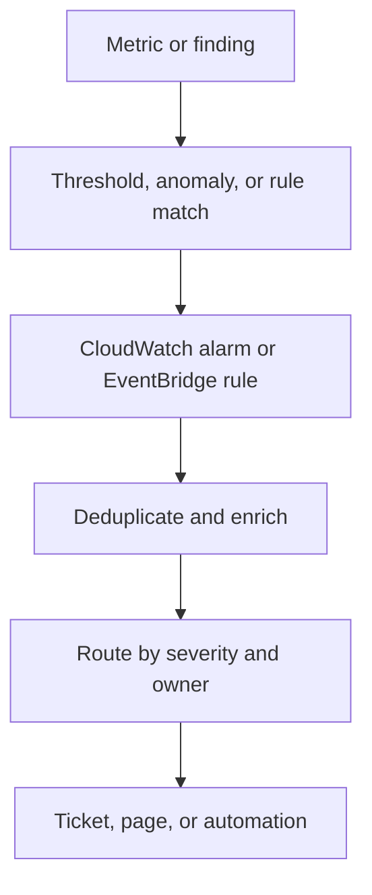
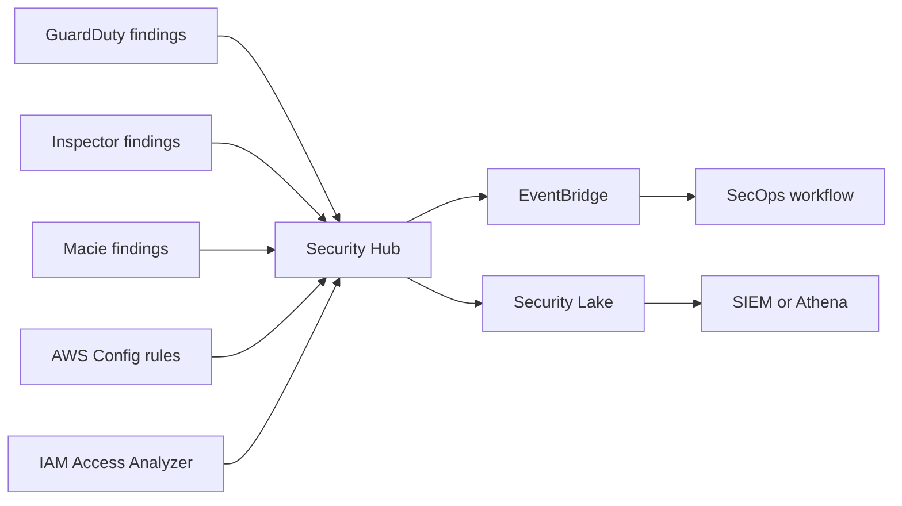
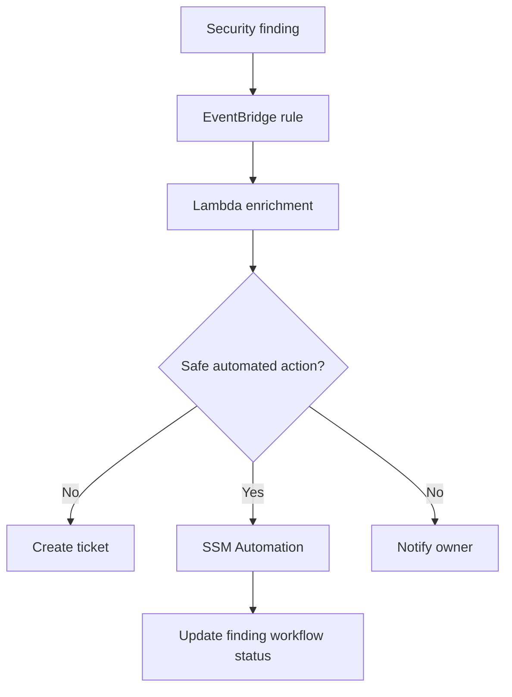
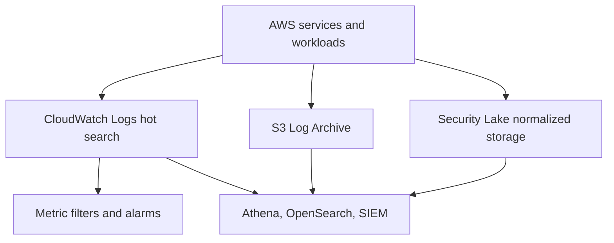
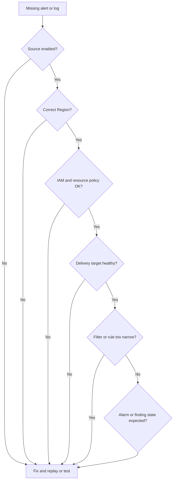

Domain 1 is about turning AWS activity into useful security signal. The practical objective is not to turn on every service and hope alerts appear. The objective is to design a repeatable detection architecture for a multi-account AWS environment: collect the right events, centralize the right findings, preserve logs, route alerts to owners, and verify that the system keeps working.

This page maps to the AWS Certified Security - Specialty Domain 1 tasks:

- Task 1.1: Design and implement monitoring and alerting solutions for an AWS account or organization
- Task 1.2: Design and implement logging solutions
- Task 1.3: Troubleshoot security monitoring, logging, and alerting solutions

## Mental Model

Detection architecture has three lanes:

- Monitoring: near-real-time health and security signal, usually CloudWatch, EventBridge, GuardDuty, Security Hub, Macie, Inspector, AWS Config, and service-native metrics.
- Logging: durable records for audit, investigation, reconstruction, and threat hunting, usually CloudTrail, VPC Flow Logs, Route 53 Resolver query logs, CloudWatch Logs, S3, Security Lake, Athena, and OpenSearch.
- Response workflow: alert routing, enrichment, suppression, ticketing, incident creation, and remediation automation.



## Enterprise Account Pattern

Use dedicated accounts instead of putting security operations in the AWS Organizations management account.

| Account                  | Detection responsibility                                                                                                    |
| ------------------------ | --------------------------------------------------------------------------------------------------------------------------- |
| Organizations management | Enable trusted access and register delegated administrators. Avoid routine security operations here.                        |
| Log Archive              | Store CloudTrail, VPC Flow Logs, Security Lake buckets, WAF logs, service logs, and immutable audit data.                   |
| Security Tooling         | Operate GuardDuty, Security Hub, Detective, Macie, Config aggregation, dashboards, investigations, and response automation. |
| Workload accounts        | Emit logs, metrics, findings, and resource configuration data. Local teams own remediation.                                 |

The AWS Security Reference Architecture recommends a Log Archive account for centralized log storage and a Security Tooling account for operating centralized security services, alerting, and response workflows. For Security Lake, AWS recommends using the Log Archive account as the delegated administrator, with the Security Tooling account as a subscriber or query consumer.

## Task 1.1 - Monitoring And Alerting

### Skill 1.1.1 - Analyze Workloads To Determine Monitoring Requirements

Start with threat and operational requirements, not tools.

Ask:

- Which identities can mutate production?
- Which resources store regulated or sensitive data?
- Which network paths are internet-facing?
- Which services can disable or weaken logging?
- Which actions should generate an immediate page instead of a ticket?
- Which signals are only useful with enrichment or correlation?

Map each workload to required signals:

| Workload trait                 | Required signal                                                                                        |
| ------------------------------ | ------------------------------------------------------------------------------------------------------ |
| Public endpoint                | Route 53 health checks, ALB/NLB metrics, WAF logs, CloudFront logs, TLS/certificate alerts             |
| Production IAM usage           | CloudTrail management events, IAM Access Analyzer, GuardDuty IAM findings, CloudWatch metric filters   |
| S3 data lake or regulated data | CloudTrail S3 data events where justified, Macie, S3 server access or CloudTrail data event strategy   |
| Container workloads            | ECR scanning, Inspector, ECS/EKS audit and runtime signals, CloudWatch Container Insights where needed |
| Private subnet workload        | VPC Flow Logs, Route 53 Resolver query logs, NAT or egress monitoring, endpoint policy monitoring      |
| Critical application           | SLO metrics, synthetic checks, error-rate alarms, dependency health, deployment events                 |

### Skill 1.1.2 - Design Workload Monitoring Strategies

Use layered monitoring:

- Service health: Route 53 health checks, CloudWatch metrics, AWS Health events.
- Resource posture: AWS Config rules, Security Hub controls, IAM Access Analyzer findings.
- Threat detection: GuardDuty, Macie, Inspector, Detective, Security Hub correlation.
- Application signal: custom metrics, logs, traces, synthetic canaries.
- Deployment signal: release events, IaC drift, configuration changes, failed deployments.



CloudWatch alarms can monitor metrics, metric math, Metrics Insights queries, and composite alarm state. Composite alarms are useful for reducing noise because they alert only when multiple underlying conditions are true.

Route 53 health checks publish CloudWatch metrics and can alert through CloudWatch/SNS. Remember that Route 53 health check metrics are viewed in `us-east-1`.

### Skill 1.1.3 - Aggregate Security And Monitoring Events

For enterprise AWS security, findings and logs should converge into a small number of places:

- Security Hub for standardized findings and posture visibility.
- EventBridge for event routing and automation.
- Security Lake for normalized security data in OCSF and Apache Parquet.
- CloudWatch Logs for operational log search, metric filters, and near-real-time troubleshooting.
- S3 in Log Archive for durable, controlled retention.



GuardDuty delegated administration is Regional. Use the same delegated administrator account in every Region where GuardDuty is enabled, and do not use the Organizations management account for routine GuardDuty administration.

Security Hub central configuration lets the delegated administrator configure Security Hub, standards, and controls across accounts and linked Regions from a home Region. The home Region is important: configuration policies are created from that Region and apply to linked Regions.

### Skill 1.1.4 - Metrics, Alerts, And Dashboards For Anomalous Events

Good alerts answer four questions:

- What happened?
- Where did it happen?
- Why does it matter?
- What should the responder do next?

Baseline alert categories:

| Category   | Example detection                                                                                                 |
| ---------- | ----------------------------------------------------------------------------------------------------------------- |
| Identity   | Root use, access key created, unusual `AssumeRole`, console login without MFA, IAM policy changed                 |
| Logging    | CloudTrail stopped, Config recorder stopped, GuardDuty disabled, Security Hub disabled, log bucket policy changed |
| Network    | Public security group change, VPC route to internet added, anomalous DNS domain, unexpected egress                |
| Data       | S3 bucket public exposure, Macie sensitive data finding, KMS key disabled, S3 Object Lock changed                 |
| Compute    | GuardDuty malware or crypto-mining finding, ECR critical CVE, privileged container task definition                |
| Governance | Config noncompliance, Security Hub critical failed controls, new account without baseline services                |

Dashboards should serve different audiences:

- SecOps dashboard: critical findings, open incidents, noisy controls, alert latency, coverage gaps.
- Cloud platform dashboard: account onboarding, detector status, Config recorder status, log delivery health.
- App owner dashboard: findings by application tag, remediation SLA, workload health.
- Executive dashboard: risk trend, critical backlog, coverage percentage, exception count.

### Skill 1.1.5 - Automations For Assessments And Investigations

Useful automations are narrow and reversible.

Examples:

- Deploy AWS Config conformance packs for baseline controls across accounts.
- Use Security Hub automation rules to suppress known benign findings, set severity, or add workflow metadata.
- Route Security Hub findings through EventBridge to Lambda, Step Functions, Systems Manager Automation, or ticketing systems.
- Use Systems Manager State Manager to keep the CloudWatch Agent, security agents, or host configuration in the expected state.
- Enrich GuardDuty findings with account owner, application tag, instance metadata, Detective links, and recent CloudTrail activity.



Good automation candidates:

- Quarantine an EC2 instance security group after a high-confidence GuardDuty finding.
- Disable an exposed access key after validation and approval.
- Re-enable a required Config recorder.
- Reapply a required CloudWatch log group retention policy.
- Open a ticket for an S3 public access finding with bucket owner and last policy change.

Poor automation candidates:

- Broadly deleting resources.
- Rotating production credentials without owner coordination.
- Suppressing findings without expiration.
- Applying remediations when the evidence source is not reliable.

## Task 1.2 - Logging Solutions

### Core Log Sources

| Source                         | Use                                                                                                                                                      |
| ------------------------------ | -------------------------------------------------------------------------------------------------------------------------------------------------------- |
| CloudTrail management events   | Control plane audit for API calls, console actions, identity activity, and service changes.                                                              |
| CloudTrail data events         | Object-level or resource-level access such as S3 object activity and Lambda invocation activity. Enable selectively because volume and cost can be high. |
| CloudTrail Insights            | Anomaly detection for unusual management API activity patterns.                                                                                          |
| AWS Config                     | Resource configuration history and compliance evaluation.                                                                                                |
| VPC Flow Logs                  | Network metadata for VPC, subnet, ENI, and transit gateway traffic analysis.                                                                             |
| Route 53 Resolver query logs   | DNS visibility for workloads in VPCs.                                                                                                                    |
| CloudWatch Logs                | Operational logs, Lambda logs, application logs, metric filters, Logs Insights, Live Tail, and retention policies.                                       |
| ALB, NLB, CloudFront, WAF logs | Edge and application request visibility.                                                                                                                 |
| EKS audit logs and ECS logs    | Container control plane and workload investigation.                                                                                                      |
| RDS, Aurora, Redshift logs     | Database activity and operational evidence.                                                                                                              |
| Security Hub findings          | Standardized posture and detection findings.                                                                                                             |
| Security Lake                  | Normalized log and event lake for longer-term hunting and third-party tool integration.                                                                  |

### Storage Pattern

Use different storage paths for different jobs.



Hot path:

- CloudWatch Logs for near-real-time troubleshooting and metric filters.
- Shorter retention for high-volume operational logs unless compliance requires longer.
- Field indexes where queries repeatedly filter by fields such as account, request ID, user ARN, source IP, or resource ID.

Archive path:

- S3 in the Log Archive account.
- KMS encryption, tightly scoped bucket policies, versioning, and Object Lock where immutability is required.
- Partition by account, Region, service, and date.
- Replicate to a backup Region if resilience or data durability requirements demand it.

Lake path:

- Security Lake for OCSF-normalized security data stored in Parquet.
- Use the Log Archive account as delegated administrator where possible.
- Configure Security Tooling as a subscriber for query or data access.
- Use Athena, OpenSearch, or third-party SIEM/SOAR tools for hunting and investigation.

### Organization CloudTrail

For an AWS organization, create an organization trail or CloudTrail Lake event data store so member account activity is captured centrally. An organization trail can log events for all accounts in the organization and deliver to S3, with optional CloudWatch Logs integration and EventBridge events.

Baseline CloudTrail requirements:

- Multi-Region management events.
- Include global service events.
- Write and read events where required.
- CloudTrail log file validation.
- Delivery to centralized S3 in Log Archive.
- KMS encryption with policies that allow CloudTrail and authorized readers only.
- Alerts on delivery failures, trail changes, and log bucket policy changes.

Common CloudTrail alerts:

- `StopLogging`
- `DeleteTrail`
- `PutEventSelectors`
- `PutInsightSelectors`
- `DeleteEventDataStore`
- `UpdateTrail`
- `PutBucketPolicy` on log buckets
- KMS key disabled or key policy changed for log encryption keys

### Security Lake

Security Lake is useful when the organization needs a normalized data lake for security logs and findings. It can collect AWS-native sources and supports custom sources. AWS-native sources include services such as CloudTrail, VPC Flow Logs, Route 53 Resolver query logs, EKS audit logs, Security Hub findings, and WAF logs.

Use Security Lake when:

- You need cross-account, cross-Region security data analysis.
- You have a SIEM that can consume S3, Athena, OCSF, or Parquet data.
- You need hunting across AWS and non-AWS sources.
- You want consistent schema normalization.

Do not treat Security Lake as a replacement for all operational logs. Keep CloudWatch Logs for near-real-time operational debugging where it fits.

## Task 1.3 - Troubleshooting Monitoring, Logging, And Alerting

When an alert or log is missing, troubleshoot in this order.



### Common Failure Modes

| Symptom                                       | Likely cause                                                                                                                                       |
| --------------------------------------------- | -------------------------------------------------------------------------------------------------------------------------------------------------- |
| GuardDuty findings not visible centrally      | Delegated admin not configured in that Region, member not associated, detector disabled, suppression rule archived findings.                       |
| Security Hub missing findings                 | Integration disabled, central configuration not applied to OU, Region not linked, findings suppressed by automation rule.                          |
| EventBridge rule not firing                   | Wrong event pattern, rule in wrong account or Region, event source emits to member account rather than central account, target permission missing. |
| CloudWatch alarm stuck in `INSUFFICIENT_DATA` | Metric not emitted, wrong dimensions, missing data treatment, period/evaluation mismatch, resource inactive.                                       |
| CloudTrail logs missing                       | Trail not multi-Region, event selector excludes events, organization trail not applied, S3 or KMS policy blocks delivery.                          |
| CloudWatch Logs missing from EC2              | CloudWatch Agent not installed, wrong agent config, SSM association failed, instance role lacks logs permissions, network path blocked.            |
| VPC Flow Logs missing                         | Flow log not attached to correct VPC/subnet/ENI, delivery role missing, destination policy incorrect, aggregation delay misunderstood.             |
| Macie findings absent                         | Macie not enabled in account or Region, bucket not in job scope, Security Hub publishing not enabled.                                              |
| Config rules not evaluating                   | Config recorder disabled, unsupported resource type, delivery channel misconfigured, service-linked role missing.                                  |
| Security Lake missing data                    | Source not enabled, organization auto-enable applies only to new accounts, subscriber not configured, Region not selected.                         |

### Troubleshooting Commands

CloudTrail:

```bash
aws cloudtrail describe-trails --include-shadow-trails
aws cloudtrail get-trail-status --name <trail-name>
aws cloudtrail get-event-selectors --trail-name <trail-name>
```

GuardDuty:

```bash
aws guardduty list-detectors --region us-east-1
aws guardduty list-members --detector-id <detector-id> --region us-east-1
aws guardduty list-findings --detector-id <detector-id> --region us-east-1
```

Security Hub:

```bash
aws securityhub get-enabled-standards --region us-east-1
aws securityhub get-findings --region us-east-1 --max-results 10
aws securityhub describe-hub --region us-east-1
```

Config:

```bash
aws configservice describe-configuration-recorders
aws configservice describe-configuration-recorder-status
aws configservice describe-compliance-by-config-rule
```

CloudWatch alarm:

```bash
aws cloudwatch describe-alarms --alarm-names <alarm-name>
aws cloudwatch describe-alarm-history --alarm-name <alarm-name>
aws cloudwatch get-metric-data --metric-data-queries file://queries.json
```

## Implementation Projects

### Project 1 - Organization Detection Baseline

Deliverables:

- Register delegated administrators for GuardDuty, Security Hub, Macie, Config, Inspector, and Security Lake where applicable.
- Enable GuardDuty in all active Regions with auto-enable for new accounts.
- Enable Security Hub central configuration in a home Region and linked Regions.
- Enable AWS Foundational Security Best Practices and selected CIS or PCI standards where relevant.
- Enable AWS Config recorders and deploy organization conformance packs.
- Route high-severity Security Hub findings to EventBridge and ticketing.

### Project 2 - Centralized Log Archive

Deliverables:

- Organization CloudTrail delivered to S3 in Log Archive.
- KMS key and S3 bucket policies that permit CloudTrail delivery and deny unapproved access.
- S3 versioning, lifecycle, replication, and Object Lock where required.
- CloudWatch alarms on CloudTrail delivery failures.
- Athena tables or Security Lake subscribers for investigation.

### Project 3 - Security Lake And SIEM Integration

Deliverables:

- Security Lake delegated admin in Log Archive.
- Sources enabled for CloudTrail, VPC Flow Logs, Route 53 Resolver query logs, Security Hub findings, EKS audit logs, and WAF where needed.
- Security Tooling account configured as query subscriber.
- SIEM integration through S3, SQS notifications, Athena, or partner connector.
- Cost controls for high-volume sources.

### Project 4 - Alert Quality Program

Deliverables:

- Severity model with page, ticket, and suppress decisions.
- Alert ownership by account, OU, application, and tag.
- Suppression rules with expiration and justification.
- Runbooks linked from each high-severity alert.
- Metrics for mean time to acknowledge, mean time to remediate, duplicate rate, and false-positive rate.

## Design Checklist

- [ ] Monitoring requirements are based on workload risk and data sensitivity.
- [ ] GuardDuty is enabled in every active Region through a delegated administrator.
- [ ] Security Hub central configuration is enabled from a home Region.
- [ ] Security Hub aggregates GuardDuty, Inspector, Macie, Config, and Access Analyzer findings.
- [ ] EventBridge routes actionable findings to tickets, pages, or automation.
- [ ] Organization CloudTrail captures multi-Region management events.
- [ ] Sensitive data and high-risk resources use selective CloudTrail data events.
- [ ] CloudTrail logs are delivered to a controlled Log Archive bucket.
- [ ] CloudWatch Logs retention and data protection policies are defined.
- [ ] Security Lake is used where normalized, long-term security data analysis is needed.
- [ ] AWS Config conformance packs are deployed for baseline controls.
- [ ] Dashboards show coverage gaps, not just finding counts.
- [ ] Troubleshooting runbooks exist for missing findings, missing logs, and noisy alarms.

## References

- [AWS Certified Security - Specialty Domain 1](https://docs.aws.amazon.com/aws-certification/latest/security-specialty-03/security-specialty-03-domain1.html)
- [AWS Security Reference Architecture - Log Archive account](https://docs.aws.amazon.com/prescriptive-guidance/latest/security-reference-architecture/log-archive.html)
- [AWS Security Reference Architecture - Security Tooling account](https://docs.aws.amazon.com/prescriptive-guidance/latest/security-reference-architecture/security-tooling.html)
- [AWS CloudTrail organization trail](https://docs.aws.amazon.com/awscloudtrail/latest/userguide/creating-trail-organization.html)
- [CloudTrail concepts](https://docs.aws.amazon.com/awscloudtrail/latest/userguide/cloudtrail-concepts.html)
- [CloudWatch alarms](https://docs.aws.amazon.com/AmazonCloudWatch/latest/monitoring/CloudWatch_Alarms.html)
- [CloudWatch Logs](https://docs.aws.amazon.com/AmazonCloudWatch/latest/logs/WhatIsCloudWatchLogs.html)
- [CloudWatch cross-account observability](https://docs.aws.amazon.com/AmazonCloudWatch/latest/monitoring/CloudWatch-Unified-Cross-Account.html)
- [GuardDuty with AWS Organizations](https://docs.aws.amazon.com/guardduty/latest/ug/guardduty_organizations.html)
- [GuardDuty findings with EventBridge](https://docs.aws.amazon.com/guardduty/latest/ug/guardduty_findings_eventbridge.html)
- [Security Hub central configuration](https://docs.aws.amazon.com/securityhub/latest/userguide/start-central-configuration.html)
- [Security Hub findings with EventBridge](https://docs.aws.amazon.com/securityhub/latest/userguide/securityhub-cwe-all-findings.html)
- [Security Lake multi-account management](https://docs.aws.amazon.com/security-lake/latest/userguide/multi-account-management.html)
- [AWS Config conformance packs](https://docs.aws.amazon.com/config/latest/developerguide/conformance-packs.html)
- [AWS Config organization conformance packs](https://docs.aws.amazon.com/config/latest/developerguide/conformance-pack-organization-apis.html)
- [Amazon Macie findings monitoring](https://docs.aws.amazon.com/macie/latest/user/findings-monitor.html)
- [Route 53 health check monitoring](https://docs.aws.amazon.com/Route53/latest/DeveloperGuide/monitoring-health-checks.html)
- [Systems Manager State Manager](https://docs.aws.amazon.com/systems-manager/latest/userguide/state-manager-about.html)
- [Amazon Detective finding analysis](https://docs.aws.amazon.com/detective/latest/userguide/analyzing-findings.html)
