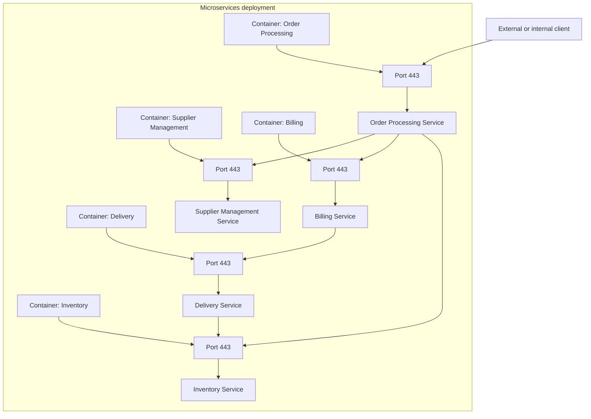
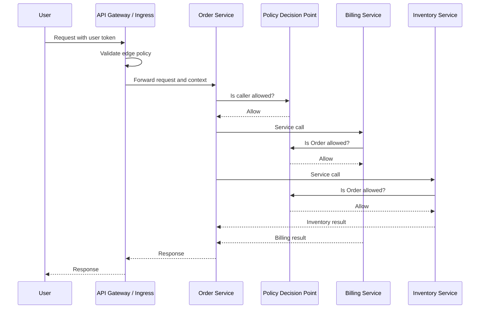
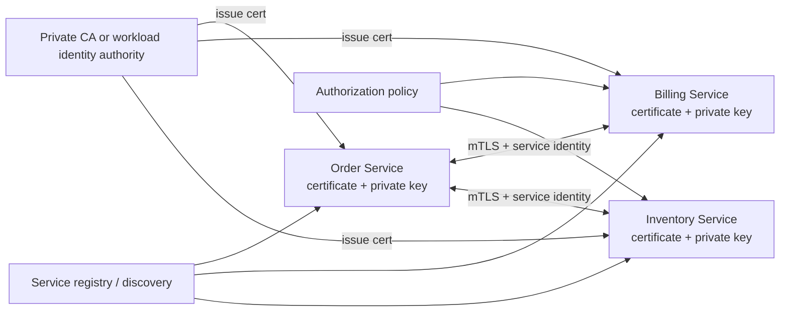
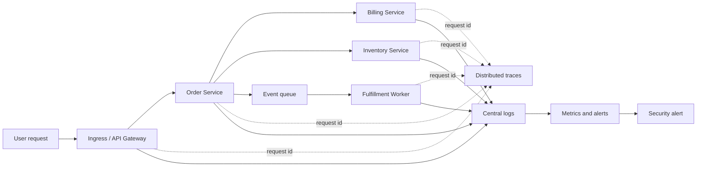
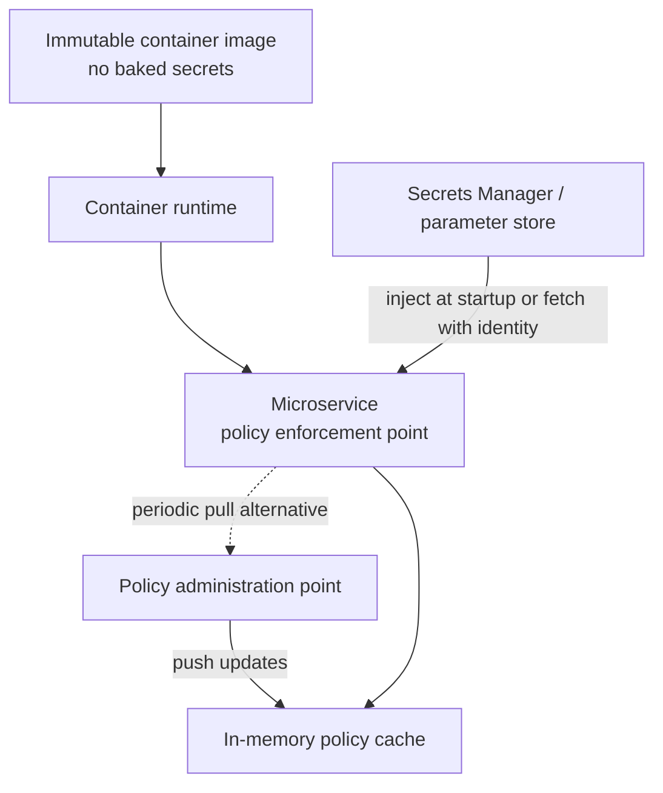
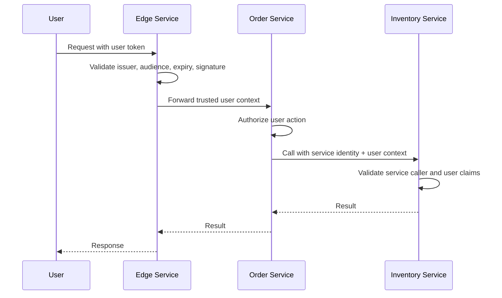
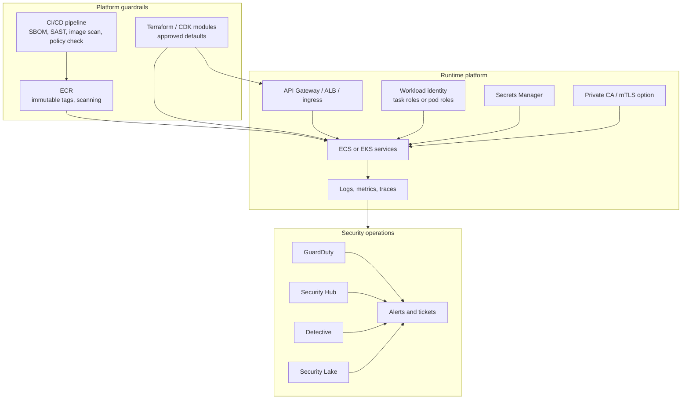

Microservices change the security model because internal application components become independently deployed services. Calls that were once in-process become network calls. Security checks that once happened at a single application boundary now need to happen repeatedly across many service boundaries.

That shift creates the core challenge: every service becomes part application component, part network endpoint, part identity principal, and part policy enforcement point.

## Attack Surface Expands

In a monolithic application, most internal components are not directly reachable over the network. A request typically enters through a small number of application entry points, such as HTTP `80` and HTTPS `443`, and then moves through internal components inside one process.

In a microservices architecture, those components become separate services. Each service may expose its own listener, API route, health endpoint, metrics endpoint, admin endpoint, queue subscription, or event consumer. The system has more doors, and each one has to be secured.

The security takeaway is simple: the strength of the system depends on the weakest exposed service. One poorly protected endpoint can become the initial foothold for lateral movement.

In AWS, this affects designs on Amazon ECS, Amazon EKS, AWS Lambda, API Gateway, Application Load Balancers, VPC Lattice, Amazon SQS, Amazon EventBridge, and any private service-to-service path. Security teams need an inventory of service entry points, not just internet-facing endpoints.

## Distributed Security Checks Add Latency

A monolith can authenticate and authorize a request once at the boundary. Microservices usually cannot rely on that model. Each service needs to validate who is calling it, whether the caller is allowed, and whether the user or workload context can be trusted.

That can introduce latency when every hop performs work such as:

- Verifying a token signature.
- Calling an identity provider or security token service.
- Fetching policy decisions from a remote authorization service.
- Checking certificate status.
- Loading secrets or configuration.
- Emitting audit logs and trace spans.

Skipping those checks and trusting the internal network is a common antipattern. A better design applies zero-trust principles: authenticate the caller, authorize the action, encrypt traffic where appropriate, and make every decision observable. The engineering challenge is doing that without making the system slow or fragile.

Practical mitigations include local token validation, short-lived cached policy decisions, sidecar or gateway enforcement, service mesh policy, and careful separation between synchronous authorization and asynchronous investigation workflows.

## Trust Bootstrapping Becomes Hard

Service-to-service trust is easy to underestimate. If Service A calls Service B, Service B needs a reliable way to know:

- What is Service A?
- Is Service A running in the expected environment?
- Is Service A allowed to call this endpoint?
- Can the credential presented by Service A be revoked or rotated?
- Who owns Service A if something goes wrong?

Certificates are a common way to establish workload identity, especially with mutual TLS. But certificates introduce lifecycle work: issuance, distribution, validation, renewal, revocation, and audit.

This is where automation becomes mandatory. Manual certificate handling might work for five services; it does not work for hundreds. In AWS environments, this often maps to patterns such as AWS Private CA for private PKI, Secrets Manager for secret material and rotation, IAM roles for AWS API access, IAM Roles for Service Accounts on EKS, and ECS task roles for per-task AWS permissions.

The important design principle is that trust must be bootstrapped by the platform, not improvised by each application team.

## Tracing Requests Is Harder

Observability becomes a security requirement in microservices. A single user action might pass through an API gateway, an order service, a billing service, an inventory service, a queue, a worker, and a notification service before it completes.

Logs, metrics, and traces each answer a different security question:

| Signal  | Security Question                                |
| ------- | ------------------------------------------------ |
| Logs    | What happened in this service?                   |
| Metrics | Is behavior abnormal compared with baseline?     |
| Traces  | Where did this request travel across the system? |

Without correlation IDs, trace IDs, consistent log fields, and centralized collection, investigations become guesswork. Security teams should be able to answer:

- Which user or workload initiated the request?
- Which services handled it?
- Which authorization decisions were made?
- Which credentials or roles were used?
- Where did the request fail or become suspicious?

In AWS, common building blocks include Amazon CloudWatch Logs, AWS X-Ray, AWS CloudTrail, Amazon GuardDuty, AWS Security Hub, Amazon Detective, Amazon Security Lake, and OpenTelemetry-based telemetry pipelines.

## Container Immutability Changes Credential And Policy Management

Microservices commonly run in containers. A secure container should be treated as immutable: build it once, deploy it, and avoid changing files inside the running container.

Immutability is good for reliability and deployment hygiene, but it creates security design questions:

- Where do service credentials come from at startup?
- How are certificates or tokens rotated without baking them into the image?
- How do services receive updated authorization policies?
- What happens when a policy changes while a container is already running?
- How do you avoid storing secrets on writable container filesystems?

A strong platform pattern keeps secrets out of container images, injects or retrieves them at runtime using workload identity, rotates them automatically where possible, and loads authorization policy from a central source.

For AWS, this usually means avoiding static secrets in images or environment variables, using task roles or pod roles for AWS API access, and using Secrets Manager or Systems Manager Parameter Store when an application truly needs a secret.

## User Context Is No Longer Shared

In a monolith, internal components can often read the same web session. In microservices, there is no shared in-process session. User context has to be passed explicitly across service boundaries.

That creates two risks:

- The receiving service may blindly trust user context from an upstream service.
- A compromised service may modify context before passing it downstream.

JWTs are commonly used to carry user claims across services because they can be signed and verified. But JWTs are not magic. Services still need to validate signatures, expiration, issuer, audience, scopes, and claims. They also need a clear rule for when to pass the original user context, when to exchange it for a downstream token, and when to use only service identity.

The safest designs distinguish between user identity and workload identity. The user may be allowed to place an order, but the Order service also needs to be allowed to call the Inventory service. Both identities matter.

## Polyglot Architecture Spreads Security Responsibility

Microservices allow teams to choose different languages, frameworks, and deployment patterns. That flexibility is useful, but it expands the security skill set required across the organization.

A single platform might include:

- Java services using Spring Security.
- Node.js services using Express middleware.
- Python services using FastAPI.
- Go services using custom middleware.
- Serverless functions with event-driven authorization.
- Kubernetes workloads with admission controls and service mesh policy.

Each stack needs secure defaults, dependency scanning, SAST, DAST where appropriate, logging conventions, secret handling, token validation, and runtime hardening. A central security team cannot manually review every service forever.

The enterprise pattern is usually hybrid:

- Central cloud security defines standards, guardrails, and detection requirements.
- Platform engineering builds reusable modules, golden paths, and paved-road controls.
- Application teams own implementation and operational health.
- Security champions help translate central requirements into each team and stack.

## AWS Reference Architecture Pattern

The goal is not to secure each microservice by hand. The goal is to make secure behavior the default path.

For AWS-heavy environments, a practical baseline includes:

- Public traffic enters through controlled ingress such as API Gateway, ALB, or an approved Kubernetes ingress controller.
- Internal service traffic is explicitly modeled with security groups, network policy, service discovery, and service identity.
- ECS task roles or EKS pod identity patterns provide least-privilege AWS API access per workload.
- Secrets are retrieved at runtime instead of baked into images.
- Container images are scanned and deployed by digest where possible.
- Runtime findings from services, containers, and hosts are sent to central security tooling.
- Logs and traces carry correlation IDs across service boundaries.

## Review Checklist

- [ ] Every service entry point is inventoried, including internal-only ports and admin endpoints.
- [ ] Services authenticate callers instead of trusting the network.
- [ ] Authorization decisions are enforced close to the resource.
- [ ] Service identity and user identity are handled separately.
- [ ] Tokens are validated for issuer, audience, expiration, signature, and intended use.
- [ ] Service-to-service certificates or credentials are issued, rotated, and revoked automatically.
- [ ] Secrets are not baked into container images.
- [ ] Policy is loaded from a central source and can be updated safely.
- [ ] Logs, metrics, and traces include correlation IDs.
- [ ] Security alerts can map a finding back to service owner, deployment, image, and request path.
- [ ] Platform modules enforce secure defaults so teams do not rebuild security from scratch.

## AWS References

- [Amazon ECS IAM roles](https://docs.aws.amazon.com/AmazonECS/latest/developerguide/ecs-iam-role-overview.html)
- [Amazon ECS Service Connect](https://docs.aws.amazon.com/AmazonECS/latest/developerguide/service-connect.html)
- [AWS X-Ray concepts](https://docs.aws.amazon.com/xray/latest/devguide/xray-concepts.html)
- [AWS Secrets Manager rotation](https://docs.aws.amazon.com/secretsmanager/latest/userguide/rotating-secrets.html)
- [AWS Private CA documentation](https://docs.aws.amazon.com/privateca/)
- [Amazon GuardDuty Runtime Monitoring](https://docs.aws.amazon.com/guardduty/latest/ug/runtime-monitoring.html)
