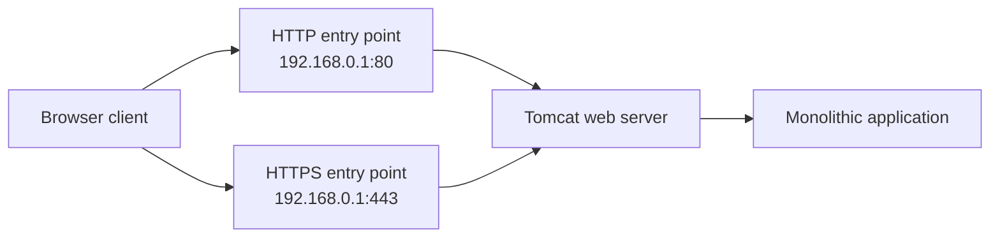
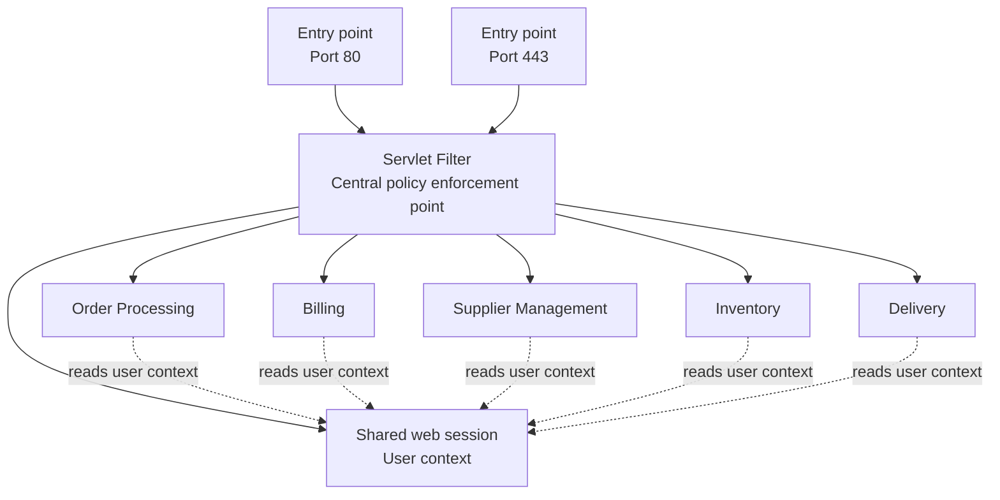

A monolithic application usually has a small number of entry points. That makes its security model easier to reason about than a distributed microservices system.

An entry point is the place where a request enters the application. In a web application, that might be HTTP on port `80` or HTTPS on port `443`. Each exposed port, listener, route, or API surface is another place where security controls must be applied. More entry points means a broader attack surface.

## Few Entry Points

In this simple example, a browser accesses a monolithic application hosted on a server at `192.168.0.1`. The application accepts HTTP and HTTPS traffic, so it has two external entry points.



Most internal components are not exposed directly to the outside world. A requester cannot call the Order Processing component, Inventory component, or Billing component over the network unless the application deliberately exposes a path to those components.

That is the first major security advantage of the monolithic model: fewer doors to guard.

## Centralized Enforcement

In a typical Java EE web application, inbound requests pass through a servlet filter or interceptor before they reach application components.

The filter acts as a centralized policy enforcement point. It can:

- Check whether the request is associated with a valid web session.
- Challenge unauthenticated users to authenticate.
- Validate whether the user has permission to perform the requested action.
- Inject user context into a shared web session.
- Reject illegitimate requests before they reach business logic.



After authentication and authorization, the application can store the requester identity and related context in the web session. Internal components can read that shared session context when they need to know who the user is.

## In-Process Trust

Once a request passes the central filter, internal component calls are usually in-process calls. For example:

```text
Order Processing -> Inventory
Order Processing -> Billing
Billing -> Delivery
```

These calls happen inside the same application runtime, not over an external network boundary. That makes them harder for a third party to intercept compared with service-to-service calls across a network.

Because of this, monolithic applications often rely on a simpler trust model:

- Enforce security at the application boundary.
- Pass only legitimate requests into the application.
- Share authenticated user context inside the process.
- Let internal components assume that boundary checks already happened.

Component-level authorization can still exist, especially for sensitive business actions, but it is not always required for every internal call.

## Why This Is Simpler Than Microservices

The monolithic model is comparatively straightforward because security enforcement is concentrated at a small number of boundaries.

Microservices change that model. Components that used to be internal functions become independently deployed services. Calls that used to be in-process become network calls. Each service might expose its own API, accept its own traffic, and require its own authentication, authorization, logging, and policy enforcement.

In a monolith, the usual question is:

> Did the request pass through the central application security layer?

In microservices, the questions multiply:

- Which service is calling which service?
- How is service identity established?
- Is the caller authorized for this operation?
- Is traffic encrypted in transit?
- Are authorization decisions consistent across services?
- Can we trace the user and request context across service boundaries?

That is why microservices security is not just "monolith security, but smaller." The security boundary moves from a small number of application entry points to many service, identity, network, and deployment boundaries.

## Review Checklist

- [ ] External entry points are known and intentionally exposed.
- [ ] HTTP and HTTPS listeners route through the same security enforcement layer.
- [ ] Authentication happens before requests reach business components.
- [ ] Authorization checks are centralized where possible.
- [ ] User context is stored consistently in session or request context.
- [ ] Sensitive operations have additional component-level authorization where needed.
- [ ] Internal components are not directly exposed to external callers.
- [ ] Logs capture authentication, authorization, and rejected request events.
