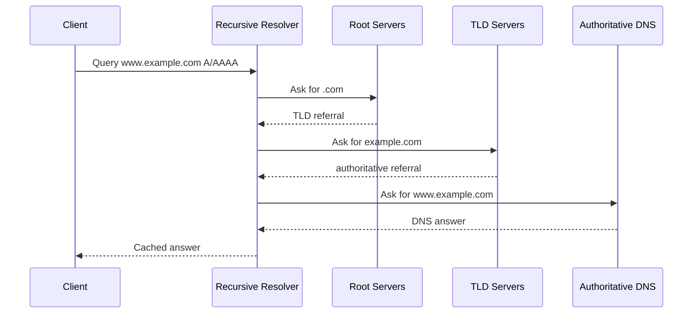
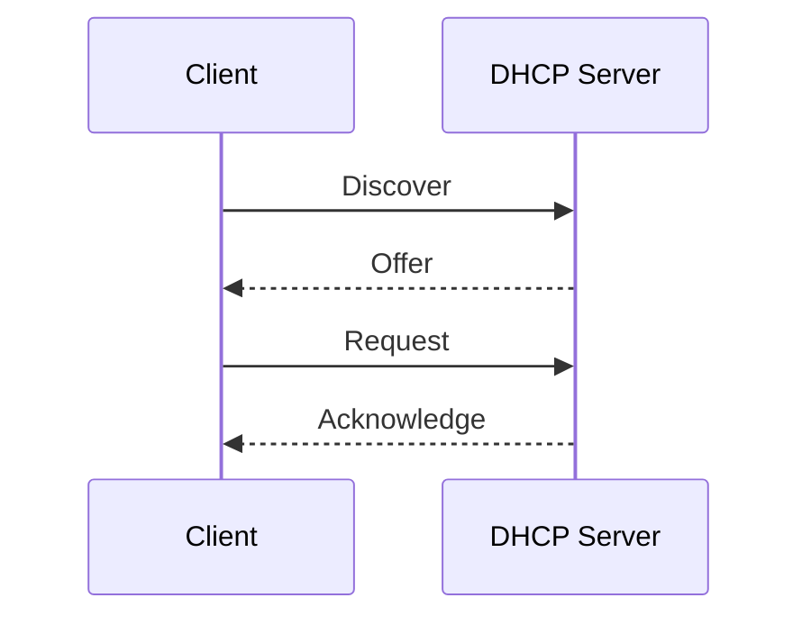
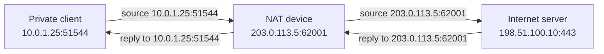

DNS, DHCP, and NAT are support systems that make networks usable at scale. They are not the same thing as routing, but they strongly influence whether a connection succeeds.

## DNS

DNS translates names into records such as IP addresses, mail exchangers, and aliases. It is hierarchical and distributed.

Common records:

| Record  | Use                                          |
| ------- | -------------------------------------------- |
| `A`     | Name to IPv4 address                         |
| `AAAA`  | Name to IPv6 address                         |
| `CNAME` | Alias to another name                        |
| `MX`    | Mail routing                                 |
| `NS`    | Delegated name servers                       |
| `TXT`   | Text data, often verification or policy data |
| `PTR`   | Reverse lookup                               |

DNS answers can be cached for the record's TTL. During incident response, remember that different resolvers may temporarily see different answers.

## DHCP

DHCP assigns network configuration to hosts automatically.

Typical DHCP-provided values:

- IP address
- Subnet mask or prefix length
- Default gateway
- DNS resolver
- Lease time
- Optional domain or vendor-specific settings

If DHCP is broken, hosts may have no address, an expired lease, a wrong gateway, or the wrong DNS resolver.

## NAT

NAT rewrites packet addresses, ports, or both. The common home and cloud outbound pattern is source NAT, often with port address translation.

NAT creates state so replies can be mapped back to the private client. When the state expires or the translation table is exhausted, connections fail in ways that can look like random network instability.

## NAT Types

| Type            | What Changes                                                   | Common Use                                      |
| --------------- | -------------------------------------------------------------- | ----------------------------------------------- |
| Source NAT      | Source address, sometimes source port                          | Private clients reaching external destinations  |
| Destination NAT | Destination address, sometimes destination port                | Port forwarding or publishing internal services |
| Static NAT      | Fixed one-to-one mapping                                       | Stable external address for a private host      |
| PAT/NAPT        | Many private connections share one public IP with unique ports | Home networks, cloud NAT gateways               |

## DNS vs NAT vs Routing

| Question                                   | System                   |
| ------------------------------------------ | ------------------------ |
| What IP should this name use?              | DNS                      |
| What address should this host use?         | DHCP or static config    |
| Which next hop should receive this packet? | Routing                  |
| Should addresses or ports be rewritten?    | NAT                      |
| Should this packet be allowed?             | Firewall/security policy |

## Security Notes

- NAT is not a security boundary by itself, but it often pairs with stateful filtering.
- DNS logs are high-value detection data because names reveal intent that IPs may hide.
- DHCP logs can help map an IP to a device at a point in time.
- Split-horizon DNS can intentionally return different answers inside and outside a network.
- DNS failures can mimic application outages; always test name resolution and direct IP reachability separately.

## References

- [Beej's Guide to Network Concepts](https://beej.us/guide/bgnet0/html/split/index.html)
- [RFC 1034: Domain Names - Concepts and Facilities](https://www.rfc-editor.org/rfc/rfc1034)
- [RFC 1035: Domain Names - Implementation and Specification](https://www.rfc-editor.org/rfc/rfc1035)
- [RFC 2131: Dynamic Host Configuration Protocol](https://www.rfc-editor.org/rfc/rfc2131)
- [RFC 3022: Traditional IP Network Address Translator](https://www.rfc-editor.org/rfc/rfc3022)
