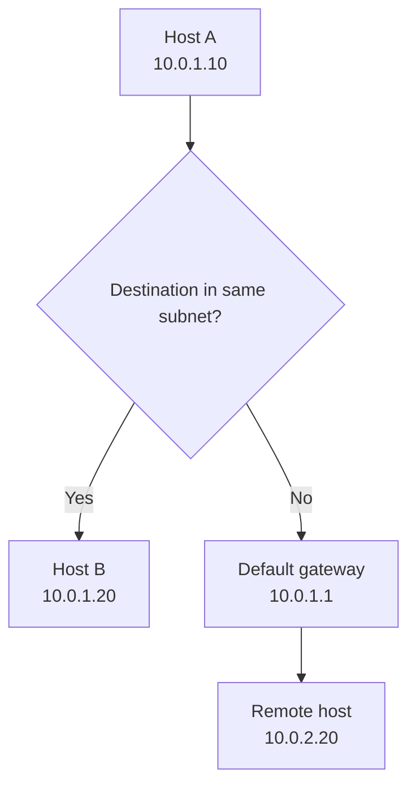
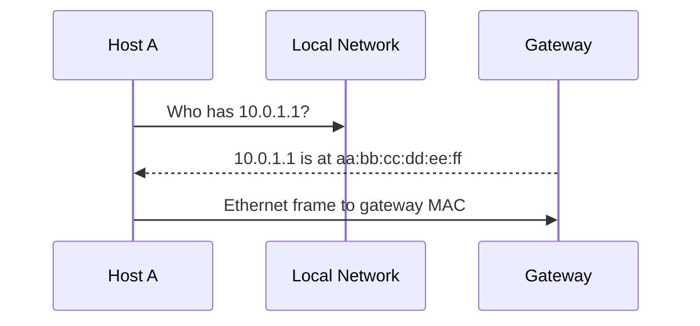

IP routing chooses the next IP hop. Link-layer delivery moves a frame across the current local network segment to the next device.

## MAC Addresses

A MAC address identifies a link-layer interface on a local network. MAC addresses are used inside Ethernet frames and are rewritten at each routed hop. They are not end-to-end internet identifiers.

## Local vs Routed Delivery

If the destination IP is in the same subnet, the host sends a frame directly to that destination's MAC address. If the destination is remote, the host sends the frame to the default gateway's MAC address, while keeping the final destination IP in the IP header.

## ARP

ARP maps an IPv4 address to a MAC address on the local link.

ARP is local-link only. Routers do not forward ARP requests across IP networks.

## Ethernet Frames

An Ethernet frame contains destination MAC, source MAC, type information, payload, and error-checking data. The payload is often an IP packet.

## Switches

Switches learn which MAC addresses are reachable from which ports. They forward frames based on a MAC table. Unknown unicast, broadcast, and some multicast frames may be flooded within the broadcast domain.

Operationally:

- Switches forward frames, not IP routes.
- VLANs split broadcast domains.
- Routers move traffic between IP networks.
- ARP and broadcast behavior scale poorly when a single L2 domain gets too large.

## Collision Domains

Modern switched Ethernet mostly avoids classic shared-medium collisions, but the concept still explains why old hubs were inefficient and why full-duplex switched links became the norm.

## Security Notes

- ARP has no strong built-in authentication. Local attackers can attempt spoofing unless mitigations exist.
- MAC allowlists are weak controls by themselves because MAC addresses can be changed.
- Packet captures on a switched network usually only show traffic visible to that switch port unless mirroring or tapping is configured.
- Many "routing" problems are actually ARP, VLAN, switch, or local gateway problems.

## References

- [Beej's Guide to Network Concepts](https://beej.us/guide/bgnet0/html/split/index.html)
- [RFC 826: Address Resolution Protocol](https://www.rfc-editor.org/rfc/rfc826)
- [IEEE 802.3 Ethernet](https://standards.ieee.org/standard/802_3-2022.html)
