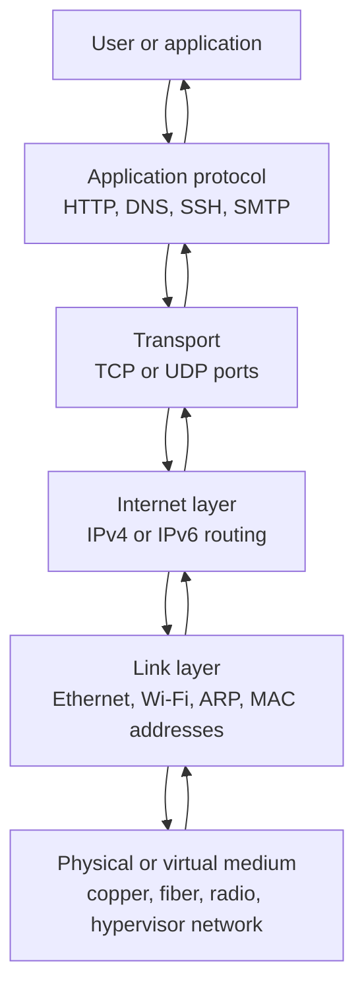

Networking is easier to reason about when you separate the problem into layers: application behavior, transport sessions, IP addressing and routing, local-link delivery, and the physical or virtual medium.

These notes condense [Beej's Guide to Network Concepts](https://beej.us/guide/bgnet0/html/split/index.html) into a smaller reference set for security engineering, cloud networking, and troubleshooting.

## Reading Order

1. [[network-concepts/networking-foundations-and-layering|Networking Foundations and Layering]]
2. [[network-concepts/sockets-http-and-application-protocols|Sockets, HTTP, and Application Protocols]]
3. [[network-concepts/ip-addressing-subnetting-and-routing|IP Addressing, Subnetting, and Routing]]
4. [[network-concepts/tcp-udp-and-packet-analysis|TCP, UDP, and Packet Analysis]]
5. [[network-concepts/ethernet-arp-and-link-layer-delivery|Ethernet, ARP, and Link-Layer Delivery]]
6. [[network-concepts/dns-dhcp-and-nat|DNS, DHCP, and NAT]]
7. [[network-concepts/network-security-and-troubleshooting|Network Security and Troubleshooting]]

## Big Picture

## Security Engineer's Mental Model

- A service is reachable only when addressing, routing, local-link delivery, and filtering all allow the path.
- A port identifies a process-facing endpoint; an IP address identifies a host or interface-facing endpoint.
- DNS names are not routing. DNS answers provide addresses that still need reachable network paths.
- NAT changes packet addresses or ports, but it does not replace routing or firewall policy.
- Packet captures, flow logs, DNS logs, and application logs answer different parts of the same question.
- Most incidents become easier when you can explain the packet path in both directions.

## Source Coverage

These notes combine the guide's chapters on clients and servers, protocols, sockets, HTTP, number representation, IP, subnetting, ports, byte order, packet inspection, routing, Ethernet, ARP, DNS, NAT, DHCP, firewalls, port scanning, and input validation.

## References

- [Beej's Guide to Network Concepts](https://beej.us/guide/bgnet0/html/split/index.html)
- [IANA Service Name and Transport Protocol Port Number Registry](https://www.iana.org/assignments/service-names-port-numbers/service-names-port-numbers.xhtml)
- [RFC 8200: Internet Protocol, Version 6 Specification](https://www.rfc-editor.org/rfc/rfc8200)
