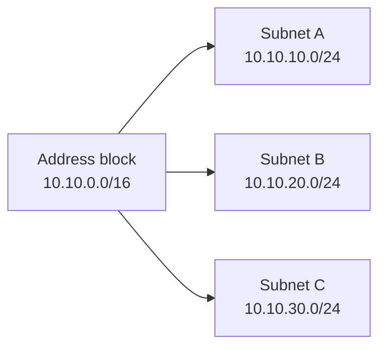
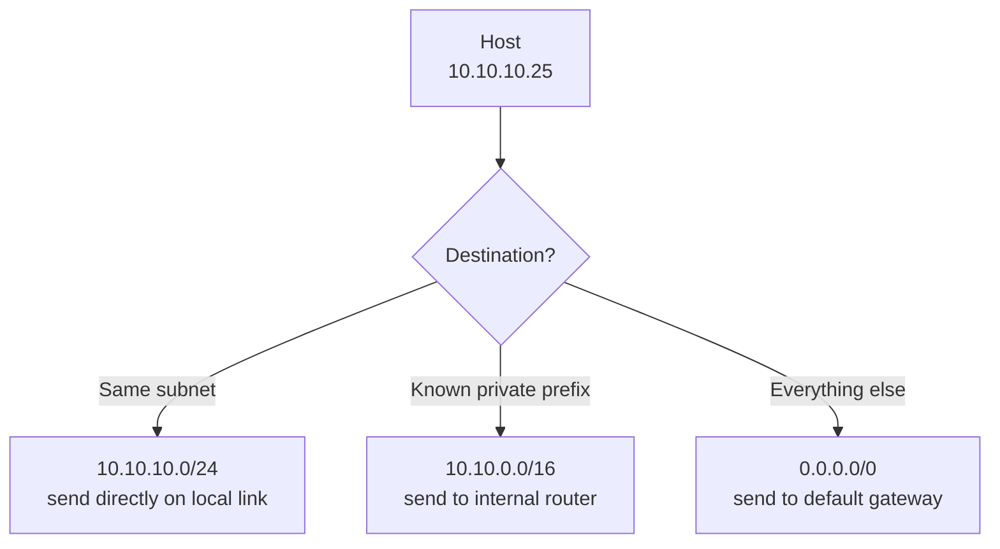

IP moves packets between networks. It provides addressing and routing, but it does not guarantee delivery, ordering, or retransmission. Reliability is handled above IP when needed.

## IPv4 and IPv6

| Feature          | IPv4                | IPv6                                                     |
| ---------------- | ------------------- | -------------------------------------------------------- |
| Address size     | 32 bits             | 128 bits                                                 |
| Common notation  | `192.0.2.10`        | `2001:db8::10`                                           |
| Address pressure | Scarce, often NATed | Vast space, usually globally routable                    |
| Broadcast        | Supported           | Not used; multicast and neighbor discovery fill the role |
| Header           | Smaller base header | Simpler fixed base header with extension headers         |

IPv4 is still common, especially inside enterprise and cloud networks. IPv6 changes the scale of addressing and makes firewall policy more important because address scarcity is no longer the natural boundary.

## Binary and Hex Matter

Human-readable addresses are shorthand for numbers.

| Representation | Where It Shows Up                            |
| -------------- | -------------------------------------------- |
| Decimal        | IPv4 octets such as `192.168.1.10`           |
| Binary         | Subnet masks, prefix matching, packet fields |
| Hexadecimal    | IPv6 groups, MAC addresses, packet dumps     |

Subnetting becomes simpler when you remember that a prefix length is just a count of fixed leading bits. Packet analysis becomes simpler when you can map a hex dump back to fields such as EtherType, IP protocol, ports, flags, and lengths.

## CIDR

CIDR notation combines an IP address and prefix length. The prefix length says how many leading bits identify the network.

| CIDR        | Address Count | Common Use                |
| ----------- | ------------: | ------------------------- |
| `/32` IPv4  |             1 | Single host route         |
| `/24` IPv4  |           256 | Small subnet              |
| `/16` IPv4  |        65,536 | Large private network     |
| `/128` IPv6 |             1 | Single IPv6 address       |
| `/64` IPv6  |          Huge | Standard IPv6 subnet size |

Example: `10.10.20.0/24` means the first 24 bits are the network prefix and the remaining 8 bits identify hosts in that subnet.

## Subnetting Mental Model

Subnetting is address planning. Routing is path selection. Firewalling is policy. Do not collapse those concepts into one vague idea of "network access."

## Routing Tables

A route table maps destination prefixes to next hops. The most specific matching route wins.

Typical fields:

| Field       | Meaning                                                      |
| ----------- | ------------------------------------------------------------ |
| Destination | Prefix to match, such as `10.0.0.0/8` or `0.0.0.0/0`         |
| Next hop    | Router, gateway, interface, tunnel, or local delivery target |
| Metric      | Preference when multiple routes match similarly              |
| Interface   | Local interface used to send the packet                      |

## Packet Forwarding

A router receives an IP packet, checks the destination IP, chooses a next hop, decrements the TTL or hop limit, and forwards the packet. It does not usually care about the application payload.

Important security detail: every hop needs a forward path, and the reply needs a return path. Many "one-way firewall" symptoms are really return-path problems.

## Private Addressing

Common private IPv4 ranges:

| Range                             | CIDR             |
| --------------------------------- | ---------------- |
| `10.0.0.0` - `10.255.255.255`     | `10.0.0.0/8`     |
| `172.16.0.0` - `172.31.255.255`   | `172.16.0.0/12`  |
| `192.168.0.0` - `192.168.255.255` | `192.168.0.0/16` |

Private IPv4 addresses are not routed on the public internet. They need private connectivity, VPN, direct connect, peering, transit routing, or NAT depending on the destination.

## Security Notes

- Overlapping CIDR ranges make peering, VPNs, mergers, and cloud-to-cloud routing painful.
- Publicly routable IPv6 on a host does not mean public access is allowed; route tables and firewalls still decide.
- Long-lived environments need IP plans that reserve space for growth, region expansion, and inspection networks.
- Route tables should be reviewed as part of incident response because a single broad route can change blast radius.

## References

- [Beej's Guide to Network Concepts](https://beej.us/guide/bgnet0/html/split/index.html)
- [RFC 1918: Address Allocation for Private Internets](https://www.rfc-editor.org/rfc/rfc1918)
- [RFC 4632: Classless Inter-domain Routing](https://www.rfc-editor.org/rfc/rfc4632)
- [RFC 8200: IPv6 Specification](https://www.rfc-editor.org/rfc/rfc8200)
