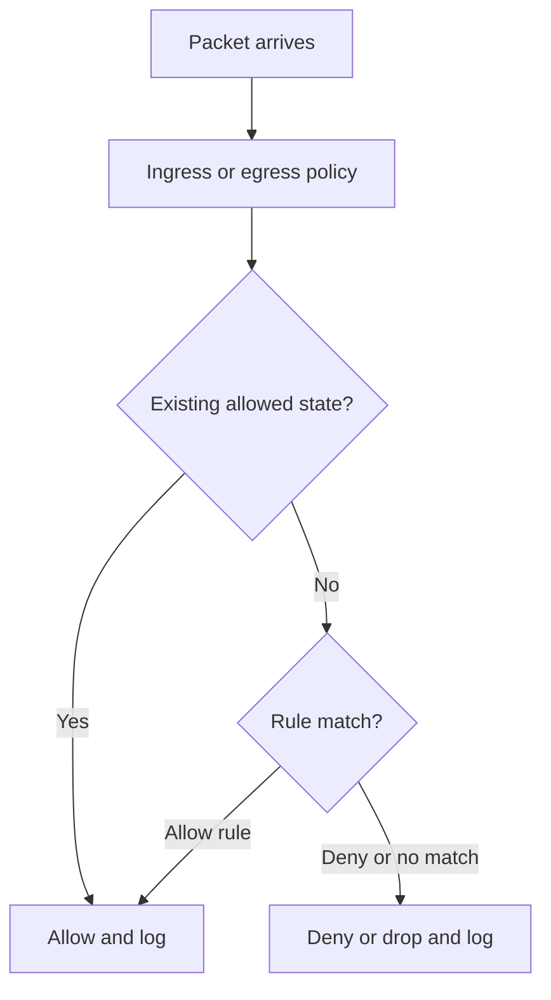
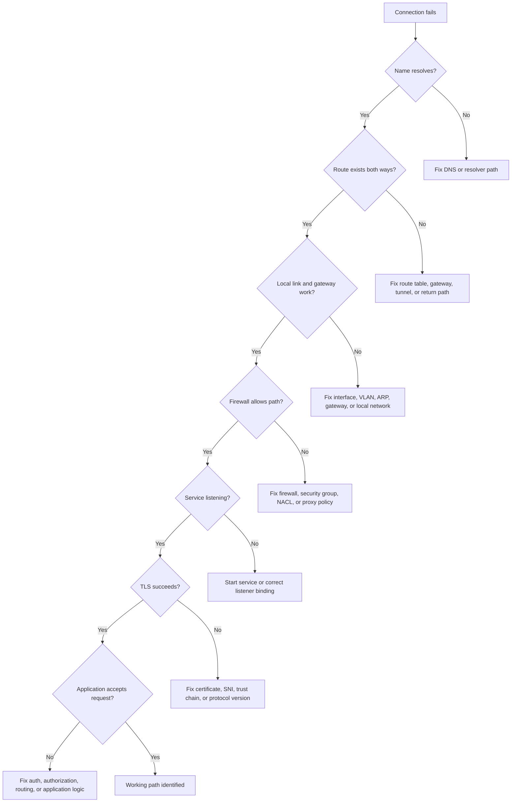

Network security starts with reachability, but it does not end there. A host can be reachable and still reject a request at TLS, authentication, authorization, or application validation layers.

## Firewalls

Firewalls apply policy to traffic. They may inspect IP addresses, ports, protocols, connection state, users, application signatures, TLS metadata, or payloads depending on the device and deployment model.

Stateful firewalls remember allowed conversations and permit return traffic automatically. Stateless firewalls evaluate every packet independently, so inbound and outbound rules must both be correct.

## Port Scanning

Port scanning tests what services appear reachable. It is useful for inventory, validation, and attacker reconnaissance.

Interpretation matters:

| Result        | Possible Meaning                                                |
| ------------- | --------------------------------------------------------------- |
| Open          | A service responded on that port                                |
| Closed        | Host reachable, no service listening                            |
| Filtered      | Firewall, ACL, routing, or packet loss prevented a clear answer |
| Open/filtered | Common with UDP when no response is received                    |

Scanning finds exposure, not full risk. Risk depends on service identity, version, authentication, authorization, data sensitivity, and exploitability.

## Input Trust

Any network-facing program must treat input as hostile unless proven otherwise. Protocol correctness is not the same as application safety.

Controls:

- Parse with strict bounds and expected formats.
- Authenticate callers before sensitive operations.
- Authorize per action, not just per connection.
- Avoid trusting client-provided source identity headers unless inserted by a trusted proxy.
- Log security-relevant failures without leaking secrets.
- Rate-limit expensive operations and unauthenticated endpoints.

## Practical Troubleshooting Flow

## Useful Evidence

| Evidence           | What It Answers                                             |
| ------------------ | ----------------------------------------------------------- |
| DNS query logs     | Which names were requested and resolved                     |
| Flow logs          | Who connected to whom, on which ports, accepted or rejected |
| Packet capture     | What packets actually appeared at a point in the path       |
| Firewall logs      | Which rule allowed or denied traffic                        |
| Load balancer logs | Client-facing request status and backend target behavior    |
| Application logs   | Auth decisions, request IDs, errors, business context       |

## Security Engineering Patterns

- Maintain an expected exposure inventory.
- Alert when new internet-facing listeners appear.
- Treat public DNS changes as production security changes.
- Monitor blocked traffic patterns for scanning and brute force attempts.
- Prefer least-reachability networks, then enforce identity and application authorization above them.
- Use packet path diagrams during design reviews and incident response.

## References

- [Beej's Guide to Network Concepts](https://beej.us/guide/bgnet0/html/split/index.html)
- [NIST SP 800-41 Rev. 1: Guidelines on Firewalls and Firewall Policy](https://csrc.nist.gov/publications/detail/sp/800-41/rev-1/final)
- [OWASP Input Validation Cheat Sheet](https://cheatsheetseries.owasp.org/cheatsheets/Input_Validation_Cheat_Sheet.html)
