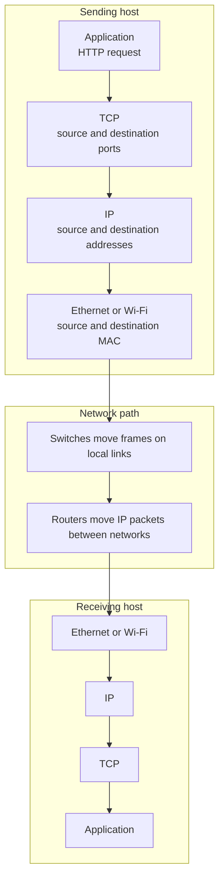
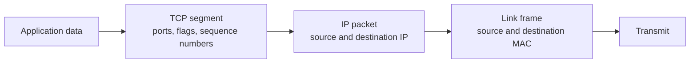

Networks exist so independent systems can exchange data through agreed formats and delivery rules. The important idea is not the wire itself; it is the set of contracts that let two programs communicate even when the hosts, operating systems, network paths, and hardware differ.

## Core Vocabulary

| Concept       | Meaning                                                            |
| ------------- | ------------------------------------------------------------------ |
| Client        | The side that initiates a request.                                 |
| Server        | The side that listens for and responds to requests.                |
| Protocol      | A shared rule set for message format, order, and meaning.          |
| Packet        | A bounded unit of network data with headers plus payload.          |
| Header        | Metadata used by a layer to deliver or interpret the payload.      |
| Payload       | The data handed down from the layer above.                         |
| Encapsulation | Wrapping higher-layer data in lower-layer headers.                 |
| Interface     | A network attachment point with addresses and link-layer behavior. |

## Layering

Layering reduces complexity. Each layer solves one class of problem and hands the result to the next layer.

The application does not need to know how Ethernet works. The IP layer does not need to understand HTTP. Ethernet does not care whether the payload is a web request, DNS query, or SSH session.

## Encapsulation

When an application sends data, each lower layer adds the metadata it needs.

On receive, the process reverses: the host validates and removes the link header, passes the IP payload upward, then transport passes application bytes to the listening process.

## Protocol Design Questions

Good protocols answer practical questions:

- Who speaks first?
- What message format is valid?
- How does the receiver know where a message begins and ends?
- Are messages reliable or best-effort?
- How are errors represented?
- Is authentication or encryption part of the protocol, delegated to another layer, or absent?

## Troubleshooting by Layer

| Symptom                                      | Useful Layer To Check                                     |
| -------------------------------------------- | --------------------------------------------------------- |
| Host cannot see gateway                      | Link layer, VLAN, Wi-Fi, cable, local firewall            |
| Host can reach gateway but not remote subnet | IP addressing, route table, router policy                 |
| TCP connection times out                     | Routing, firewall, security group, NACL, return path      |
| TCP connection resets                        | Service not listening, proxy reset, application rejection |
| DNS name fails but IP works                  | DNS resolution path                                       |
| HTTPS fails but TCP connects                 | TLS, certificate, SNI, application proxy                  |

## Security Notes

- Every layer can enforce or break security controls.
- Encryption at one layer does not automatically protect metadata at lower layers.
- Firewalls usually inspect IP addresses, ports, state, and sometimes application fields.
- A packet capture near the client and one near the server can quickly reveal where assumptions diverge.

## References

- [Beej's Guide to Network Concepts](https://beej.us/guide/bgnet0/html/split/index.html)
- [RFC 1122: Requirements for Internet Hosts](https://www.rfc-editor.org/rfc/rfc1122)
