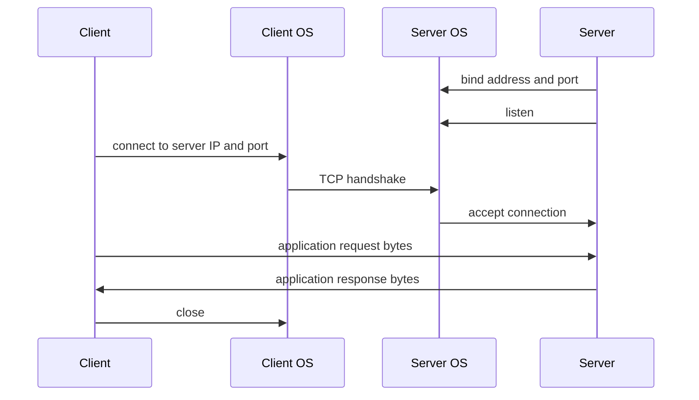
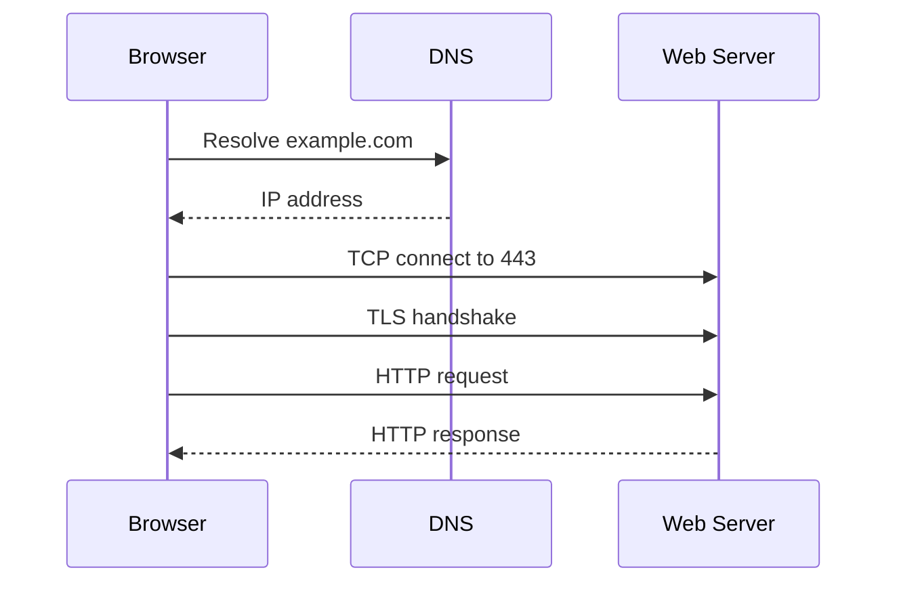

A socket is the programming interface an application uses to send and receive network data. The operating system owns the protocol details, and the application reads or writes bytes through a socket.

## Socket Tuple

Network conversations are commonly identified by a tuple:

| Field            | Example        |
| ---------------- | -------------- |
| Protocol         | TCP            |
| Source IP        | `10.0.1.25`    |
| Source port      | `51544`        |
| Destination IP   | `203.0.113.10` |
| Destination port | `443`          |

For TCP, that tuple identifies one connection. Many clients can connect to the same server IP and destination port because their source IPs and ephemeral source ports differ.

## Client and Server Flow

## Ports

Ports let one host run many network services. The destination port normally identifies the service being contacted. The source port is often an ephemeral port chosen by the client OS.

| Port Type  | Typical Use                                                        |
| ---------- | ------------------------------------------------------------------ |
| Well-known | Common services such as DNS `53`, HTTP `80`, HTTPS `443`, SSH `22` |
| Registered | Application/vendor-assigned service ports                          |
| Ephemeral  | Temporary client-side ports for outbound connections               |

Security tooling often starts with ports, but ports are only hints. A service can run on a nonstandard port, and encrypted protocols can hide application details from simple inspection.

## HTTP In One Page

HTTP is a request/response application protocol. A client sends a method, path, headers, and optional body. A server returns a status code, headers, and optional body.

Common methods:

| Method   | Typical Meaning                             |
| -------- | ------------------------------------------- |
| `GET`    | Retrieve a representation                   |
| `POST`   | Submit data or create subordinate data      |
| `PUT`    | Replace or create a resource at a known URI |
| `PATCH`  | Partially update a resource                 |
| `DELETE` | Request deletion                            |

Common status classes:

| Status Class | Meaning                               |
| ------------ | ------------------------------------- |
| `2xx`        | Success                               |
| `3xx`        | Redirection                           |
| `4xx`        | Client-side error or rejected request |
| `5xx`        | Server-side failure                   |

## Application Protocol Patterns

Application protocols define the meaning of bytes after transport delivery. Some are text-oriented and easy to inspect. Others are binary, compressed, multiplexed, or encrypted.

| Pattern                | Examples                      | Security Implication                                  |
| ---------------------- | ----------------------------- | ----------------------------------------------------- |
| Request/response       | HTTP, DNS                     | Easy to model, proxy, and log.                        |
| Long-lived session     | SSH, database protocols       | Requires connection state and idle-timeout decisions. |
| Message stream         | WebSocket, gRPC streaming     | Needs end-to-end tracing and backpressure handling.   |
| Broadcast or discovery | DHCP, ARP-like local behavior | Often constrained to local network segments.          |

## Security Notes

- An open port means something answered; it does not prove the application is authorized, healthy, or safe.
- HTTP security depends heavily on TLS, headers, authentication, authorization, and input validation.
- Reverse proxies and load balancers terminate or relay client sessions, so logs must preserve client identity through trusted headers.
- For cloud troubleshooting, compare listener config, security group rules, route tables, health checks, and application logs.

## References

- [Beej's Guide to Network Concepts](https://beej.us/guide/bgnet0/html/split/index.html)
- [IANA Port Number Registry](https://www.iana.org/assignments/service-names-port-numbers/service-names-port-numbers.xhtml)
- [MDN HTTP Overview](https://developer.mozilla.org/en-US/docs/Web/HTTP/Guides/Overview)
