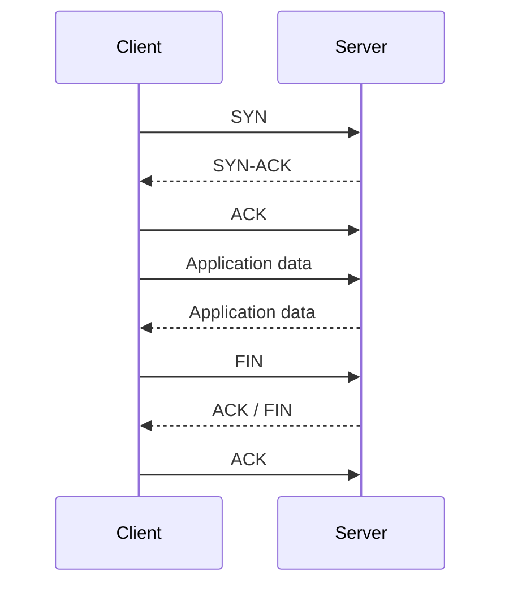
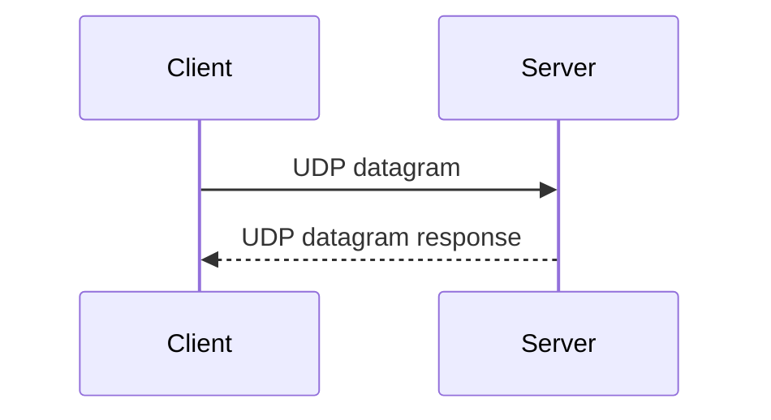
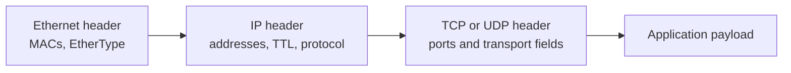

Transport protocols connect application behavior to IP delivery. TCP provides ordered, reliable byte streams. UDP provides simple datagrams with minimal overhead and no built-in delivery guarantees.

## TCP vs UDP

| Feature                  | TCP                                    | UDP                                    |
| ------------------------ | -------------------------------------- | -------------------------------------- |
| Model                    | Connection-oriented byte stream        | Connectionless datagrams               |
| Reliability              | Retransmission, ordering, flow control | Application must handle loss if needed |
| Handshake                | Yes                                    | No                                     |
| Common Uses              | HTTP(S), SSH, databases, SMTP          | DNS, DHCP, VoIP, streaming, QUIC       |
| Operational Failure Mode | Timeouts, resets, half-open sessions   | Drops, loss, fragmentation issues      |

## TCP Connection Flow

Security devices often use TCP state to allow replies for established connections. Stateless controls must explicitly allow both directions.

## UDP Flow

UDP has less protocol overhead, but loss, ordering, and retries are up to the application. DNS traditionally used UDP for small queries, while QUIC builds a modern secure transport above UDP.

## Byte Order

Network protocols need consistent binary representation across different CPU architectures. Multi-byte integers in protocol headers are commonly represented in network byte order, which is big-endian.

Why this matters:

- Packet parsing must read fields with the correct byte order.
- Custom binary protocols need explicit serialization rules.
- Security tooling that decodes packets incorrectly can misclassify traffic.

## Packet Anatomy

Packet analysis usually asks:

- What layer is visible at this capture point?
- Are source and destination addresses expected?
- Are source and destination ports expected?
- Does the packet leave, arrive, and return?
- Is a middlebox rewriting addresses, ports, or headers?
- Does the application payload match the claimed protocol?

## Common TCP Signals

| Signal                              | Meaning                                                           |
| ----------------------------------- | ----------------------------------------------------------------- |
| SYN sent, no SYN-ACK                | Server unreachable, port filtered, route issue, return path issue |
| SYN-ACK received, final ACK missing | Client path or firewall issue                                     |
| RST from server                     | Port closed, app rejected, proxy reset, policy reset              |
| TLS alert after TCP success         | TLS or application-layer problem                                  |
| Repeated retransmissions            | Loss, asymmetric filtering, MTU, congestion, or blackhole         |

## Fragmentation and MTU

Packets larger than the path supports can fragment or fail. Fragmentation creates operational and security problems because not every device handles fragments consistently. Path MTU discovery failures can look like mysterious application hangs, especially when small packets work and large transfers fail.

## Security Notes

- Packet captures are strongest when paired with logs and flow records.
- TCP success does not mean application authorization succeeded.
- UDP services need careful exposure control because they are often easier to spoof or abuse for amplification.
- Firewalls should be explicit about statefulness. Stateful controls are easier for outbound client flows; stateless controls require mirrored thinking.

## References

- [Beej's Guide to Network Concepts](https://beej.us/guide/bgnet0/html/split/index.html)
- [RFC 9293: Transmission Control Protocol](https://www.rfc-editor.org/rfc/rfc9293)
- [RFC 768: User Datagram Protocol](https://www.rfc-editor.org/rfc/rfc768)
